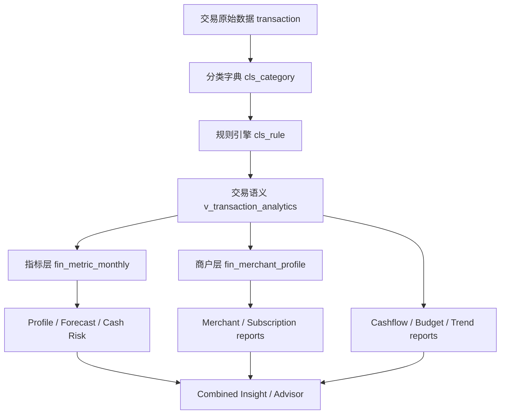

# FinSight v1.8 数据基础驱动版本计划

日期：2026-06-18
目标版本：v1.8.0 / v1.8.1 / v1.9.0
范围：Categories、Rule Engine、基础交易语义、SQL 数据审计、报表准确性。

## 1. 核心判断

当前项目已经不是缺少报表或页面的问题。最新代码已经具备：

- 分类管理：`Admin / Categories` 可以维护收入、固定支出、日常生活、购物、交通、教育、娱乐、报销、资产、负债、投资、理财、手续费、其它消费等层级。
- 规则引擎：`Admin / Rule Engine` 已有分类树、规则列表、active/off/orphaned/invalid 状态、keyword 搜索、未分类关键词建议。
- 报表体系：Cashflow、Budget vs Actual、Spending Drift、Trend Changes、Annual Outlook、Cash Risk、Merchant reports、Unified Drilldown。
- 数据基础：`transaction`、`cls_category`、`cls_rule`、`cls_rule_tag`、`v_transaction_analytics`、`fin_metric_monthly`、`fin_merchant_profile`。

下一阶段的重点应该从“新增功能”转为“基础数据治理驱动上层业务准确性”：

如果分类、规则、商户 token、交易方向、固定/可变口径不清晰，上层报表只会把错误放大。因此 v1.8 应定义为 Data Foundation Release。

## 2. 当前状态分析

### 2.1 Categories

从截图看，一级分类已经覆盖主要个人金融语义：

- 收入
- 固定支出
- 日常生活
- 购物与耐用品
- 交通与车辆
- 教育与培训
- 娱乐与旅行
- 人情与公益
- 报销与返还
- 资产变动
- 负债变动
- 投资活动
- 理财与金融产品
- 金融手续费
- 其它消费

优势：

- 一级分类已经接近专业个人财务分析的主干。
- 同时覆盖损益类、资产负债类和资金流类，有能力支持现金流、资产变动、负债、投资等不同报表口径。
- 后端 `v_transaction_analytics` 已输出 `category_l1_code/category_l1_name`、`consume_l1/consume_l2`，具备向上汇总能力。

不足：

- 分类页只显示树和编辑表单，没有显示每个分类被多少交易、多少规则、多少金额使用。
- 无法从分类页直接看到分类是否“空分类”“规则不足”“交易异常集中”“上月变化异常”。
- 分类只能人工维护，没有版本号、变更说明、合并预览、影响范围统计。
- `parent_id` 在代码中实际大量使用父级 code，字段名仍叫 parent_id，容易让后续开发误解。
- 分类删除会 soft delete 并停用规则，但缺少“删除前影响预览”：会影响多少交易、多少规则、多少报表金额。

### 2.2 Rule Engine

从截图看，当前规则状态为：

- All rules：451
- Active：426
- Off：25
- Orphaned：24
- Invalid / legacy：6

优势：

- 已经能识别 orphaned 和 invalid/legacy。
- 已经按分类树统计规则数量，例如日常生活 184、固定支出 52、交通与车辆 50。
- 已经有未分类关键词建议入口。
- 后端 `ClassificationRuleValidator` 会把规则 categoryId 标准化为 category code，避免新规则继续写入旧 id。

不足：

- 24 条 orphaned 说明历史分类迁移仍有尾部风险；这些规则即使停用，也代表已有交易或导入逻辑曾经依赖旧分类。
- 规则数量和规则质量没有分开。日常生活 184 条规则多，不一定代表分类准确，可能存在重复、冲突、过宽关键词。
- 规则没有命中率、最近命中时间、近 30 天影响金额、误分类回滚率。
- 规则 priority 只排序，不展示冲突解释；用户不知道同一个交易为什么命中 A 而不是 B。
- 缺少“测试规则影响范围”：新增或修改规则前无法预览会影响多少未分类交易、多少已分类交易。

### 2.3 基础交易语义

现状：

- `transaction` 保留原始字段和分类字段。
- `v_transaction_analytics` 统一方向、金额、分类、商户、退款、转账、固定支出等语义字段。
- Metrics、Profile、Forecast、Merchant Mining、Drilldown 都在使用交易语义层。

重点风险：

- `MerchantMiningService` 使用 `MerchantNormalizer.normalizeToken()` 去除订单号、支付通道、门店号。
- `v_transaction_analytics` 和 `TransactionMapper.xml` 的 drill merchant token 仍使用 `lower(trim(opponent_name/transaction_desc))`。
- 这会导致 Merchant reports 里的稳定 merchantToken 和 drilldown SQL 里的 token 不完全一致。结果是商户报表看起来正确，但点击下钻可能查不全交易。

这类问题必须优先修复，因为它直接影响用户对报表的信任。

### 2.4 报表准确性

最新版本已经完成不少上层优化：

- Transactions server-side sorting 已加入 `TransactionSort`。
- Unified Drilldown 已改为后端 breakdown API，并支持 partial warning。
- Annual Outlook 已有场景输入组件。
- Combined Insight 已把 Profile、Trend、Forecast、Merchant 组合成建议。
- 前端 lint 已经从 error 降到 warning，整体质量明显提高。

剩余问题不在页面数量，而在报表可信度：

- 每个报表是否能说明“数据质量是否足够好”。
- 每个数字是否能追溯到 SQL。
- 分类口径变化后，历史报表是否可比。
- 规则修改后，导入分类结果是否可解释、可回滚。

## 3. 版本计划

### v1.8.0：Classification Data Governance

目标：让分类和规则成为可信的数据资产。

交付：

- Categories 页面增加分类质量面板：
  - 交易数量
  - 当前期间金额
  - 规则数量
  - 未分类影响
  - 最近导入命中数
  - 是否空分类
  - 是否有 orphan rule
- Rule Engine 增加规则质量面板：
  - active/off/orphan/invalid
  - duplicate pattern
  - broad keyword risk
  - priority conflict
  - no recent hit
  - high impact rule
- 新增 SQL 审计脚本：`docs/tech/database/classification-data-audit.sql`。
- 修复商户 token 口径不一致：
  - 将 normalized merchant token 持久到可查询字段，或新增 `v_transaction_analytics.merchant_token_normalized`。
  - Merchant reports、drilldown、Trend Changes 全部使用同一个 normalized token。
- 增加分类/规则变更影响预览：
  - 删除分类前显示关联交易、规则、金额。
  - 修改规则前显示将影响的交易样本。

验收：

- Orphaned rules 从 24 降到 0，或全部明确归档为 inactive legacy。
- Invalid / legacy 从 6 降到 0，或全部有 remark 说明。
- 分类页能回答：“这个分类是否健康、用了多少、影响多少报表金额。”
- Rule Engine 能回答：“这个规则是否安全、命中过什么、是否和其它规则冲突。”
- Merchant report 下钻金额和报表金额一致。

### v1.8.1：Report Data Quality Layer

目标：让每个报表都能显示数据可信度和 SQL 可追溯性。

交付：

- 每个核心报表增加 Data Quality strip：
  - 未分类交易数和金额占比
  - transfer excluded count
  - refund excluded count
  - orphan category transaction count
  - merchant token coverage
  - metrics source：stored metric / report SQL fallback
- Report drilldown 增加 provenance：
  - report id
  - source view
  - filter params
  - aggregate total
  - sample count
  - truncated flag
- SQL 审计查询和 UI 指标字段一一对应。

验收：

- Cashflow、Budget vs Actual、Spending Drift、Trend Changes、Annual Outlook、Cash Risk、Merchant reports 都显示数据质量。
- 当未分类比例过高时，报表给出明确提示：“先修分类，再相信趋势。”
- 任意报表数字可以通过 SQL audit query 复核。

### v1.9.0：Classification Intelligence and Recalculation

目标：让规则和分类变更能够安全地驱动历史数据重算。

交付：

- 分类规则 impact preview：
  - preview matched unclassified rows
  - preview already classified rows that would change
  - show amount impact by category
- 分类规则 dry-run reclassify：
  - 不直接覆盖历史交易
  - 输出 before/after category
  - 支持用户确认后批量应用
- 分类变更版本化：
  - category taxonomy version
  - rule set version
  - metric refresh version
- 指标重算：
  - 分类/规则变更后标记受影响月份 dirty
  - refresh `fin_metric_monthly`
  - 刷新 merchant profiles
  - 刷新 combined insights

验收：

- 用户修改一个高影响规则前能看到影响范围。
- 用户能安全重算历史月份。
- 报表能显示当前使用的 taxonomy/rule version。

### v2.0：Data-Driven Financial Advisor

目标：让上层 Advisor 不只是展示结论，而是基于可审计的数据链给用户具体指导。

交付：

- Advisor card 展示：
  - 数据质量
  - 分类证据
  - 规则证据
  - 交易样本
  - 预测影响
  - 推荐动作
- 用户反馈进入模型：
  - 接受/忽略建议
  - 标记误分类
  - 标记商户别名
  - 调整预算后跟踪结果
- 预测回测：
  - forecast vs actual
  - category forecast error
  - merchant recurring error

验收：

- 用户能看到“为什么给我这个建议”，并能用交易证据验证。
- 用户执行动作后，后续报表能反映效果。

## 4. P0 Bug 和数据风险

### P0-1. 商户 token 口径不一致

问题：

- Merchant Mining 使用 Java `MerchantNormalizer`。
- Drilldown SQL 使用简单 lower/trim。

影响：

- Merchant Concentration、Subscriptions、Merchant Drift 点击下钻时可能漏交易。
- Combined Insight 引用商户证据时，交易样本可能不完整。

修复：

- 新增数据库侧 normalized token 生成逻辑，或在交易导入/刷新 merchant profile 时写入统一 token。
- `v_transaction_analytics`、`TransactionMapper.drillMerchantBreakdown`、`filterMerchantTokenT`、Merchant reports 全部使用同一 token。

验收：

- 同一 merchantToken 在 Merchant report、Trend Changes、Drilldown、Transactions URL 中返回一致交易集合。

### P0-2. Orphaned rules 需要清零或归档

问题：

- 截图显示 24 条 orphaned rules。

影响：

- 用户看到规则仍存在但目标分类无效。
- 历史迁移后的分类规则质量不可控。

修复：

- 用 SQL 找出 orphan rules。
- 对可映射规则批量迁移到新 category code。
- 对不可映射规则标记 inactive legacy，并写 remark。

验收：

- Rule Engine 的 Orphaned 显示为 0，或只显示已归档 legacy。

### P0-3. Invalid / legacy rules 需要显式处理

问题：

- 截图显示 6 条 invalid/legacy。

影响：

- 无 keyword 的规则不会命中，但会干扰用户理解总规则数。

修复：

- 删除无业务价值规则。
- 或保留为 inactive legacy，并在 remark 记录原因。

验收：

- Invalid / legacy 为 0，或所有行都有明确 remark。

### P0-4. 分类删除/迁移缺少影响预览

问题：

- 当前分类删除会 soft delete 并停用关联规则。
- 迁移方法支持 cascade，但 UI 侧缺少清晰的预览和确认。

影响：

- 可能导致历史交易分类变化、报表跳变、规则 orphan。

修复：

- 删除/迁移前展示：
  - affected transactions
  - affected amount by year/month
  - affected rules
  - affected reports
- 需要二次确认。

验收：

- 用户删除或迁移分类前能知道报表影响。

### P0-5. 分类字段双写一致性

问题：

- 交易中同时存在 `consume_id`、`consume_code`、`consume_name`、`category_code/category_name` 兼容字段。

影响：

- 如果只有部分字段更新，上层报表可能根据不同字段得出不同分类。

修复：

- 定义单一事实源：`consume_code` 为主，`consume_name` 由 `cls_category` join 得出。
- 写操作统一由 service 同步字段。
- SQL 审计长期检查不一致行。

验收：

- 交易分类字段一致性审计为 0。

## 5. P1 功能细化

### P1-1. Categories 从维护页升级为分类资产页

新增指标：

- Category usage：交易数、金额、最近交易日期。
- Rule coverage：规则数、active 数、最近命中。
- Data quality：未分类金额、orphan transaction、soft-deleted 引用。
- Report impact：影响哪些报表和 KPI。

交互：

- 点击分类显示右侧详情，而不是只有编辑表单。
- 支持 “View transactions”、“View rules”、“View report impact”。
- 删除/迁移必须先进入 impact preview。

### P1-2. Rule Engine 从规则列表升级为规则质量台

新增指标：

- Rule hit count。
- Last matched date。
- Matched amount last 30/90 days。
- Duplicate keyword。
- Conflicting category。
- Broad keyword risk，例如“支付”“消费”“转账”。
- Wrong direction risk，例如收入分类规则命中支出交易。

交互：

- 新增/编辑规则时可以 test against recent transactions。
- 显示 top candidate rows。
- 支持 dry-run apply。

### P1-3. SQL 数据审计进入日常流程

新增脚本：

- `docs/tech/database/classification-data-audit.sql`

用途：

- 发布前手动执行。
- 数据迁移前后对比。
- 分类调整前评估影响。
- 后续可接入 `/api/v1/maintenance` 或 GitHub Actions。

### P1-4. 报表数据质量提示

每个报表显示：

- Data coverage。
- Classification coverage。
- Transfer/refund exclusion。
- Source view。
- Metrics reconciliation status。

当数据质量不足时：

- 降低 insight confidence。
- 直接提示用户先打开 Rule Engine 或 Transactions 未分类视图。

## 6. 可执行工作计划

### Sprint 1：数据审计和风险清理

周期：1-2 天
目标版本：v1.8.0-beta.1

任务：

- 执行 SQL audit。
- 清理 orphaned rules。
- 清理 invalid / legacy rules。
- 找出交易分类字段不一致行。
- 找出 merchant token 下钻不一致样本。

输出：

- 数据质量基线。
- 修复清单。
- 审计 SQL 固化到仓库。

### Sprint 2：分类和规则影响预览

周期：3-5 天
目标版本：v1.8.0-beta.2

任务：

- Categories 增加 usage/impact 面板。
- Rule Engine 增加 hit/impact 面板。
- 删除/迁移分类前增加 impact preview。
- 修改规则前增加 dry-run preview。

输出：

- 分类和规则变更可评估。
- 避免基础数据变更造成报表突变。

### Sprint 3：统一 merchant token 和报表下钻

周期：2-4 天
目标版本：v1.8.0-rc.1

任务：

- 统一 merchant token normalization。
- 更新 `v_transaction_analytics` 和 drill SQL。
- 增加 merchant token 一致性测试。
- 回归 Merchant reports、Trend Changes、Unified Drilldown。

输出：

- 商户报表和下钻交易一致。

### Sprint 4：报表数据质量层

周期：3-5 天
目标版本：v1.8.0

任务：

- 核心报表接入 data quality strip。
- Profile / Forecast / Combined Insight 接入数据质量权重。
- 增加 metric reconciliation 展示或 API。

输出：

- 用户知道什么时候可以信任报表，什么时候必须先修数据。

### Sprint 5：分类重算和版本化

周期：5-8 天
目标版本：v1.9.0

任务：

- 分类 taxonomy version。
- Rule set version。
- Dirty month 标记。
- 指标重算。
- Forecast / Merchant / Combined Insight 刷新链路。

输出：

- 基础数据变更可以驱动上层业务重新计算。

## 7. SQL 审计清单

已新增 `docs/tech/database/classification-data-audit.sql`，覆盖：

- 分类树健康。
- orphaned rules。
- invalid rules。
- duplicate patterns。
- rule/category usage。
- 交易未分类率。
- 交易分类字段一致性。
- 报表聚合口径。
- merchant token 覆盖。
- fixed/variable 口径。
- refund/transfer 排除口径。

建议每次分类大调整前后执行一次，并保存结果。

## 8. GitHub Issue 拆分建议

1. `fix(classification): normalize merchant token contract for reports and drilldown`
2. `fix(classification): resolve orphaned and invalid legacy rules`
3. `fix(data): audit and repair transaction category field drift`
4. `feat(categories): show category usage and report impact`
5. `feat(rules): add rule hit count and dry-run impact preview`
6. `feat(reports): add data quality strip to core reports`
7. `feat(metrics): expose metric reconciliation status in reports`
8. `feat(data): add taxonomy and rule-set versioning`
9. `feat(data): mark dirty months and refresh metrics after classification changes`
10. `docs(data): maintain SQL audit checklist for classification governance`

## 9. Definition of Done

v1.8.0 完成标准：

- `npm test` 通过。
- `npm run lint` 无 error。
- `mvn test` 通过。
- `mvn checkstyle:check` 通过。
- Orphaned rules 为 0，或全部明确 inactive legacy。
- Invalid rules 为 0，或全部明确 inactive legacy。
- 未分类交易金额占比可见。
- 每个核心报表显示 data quality。
- Merchant report 下钻金额和报表金额一致。
- 分类或规则变更前可以看到影响范围。

