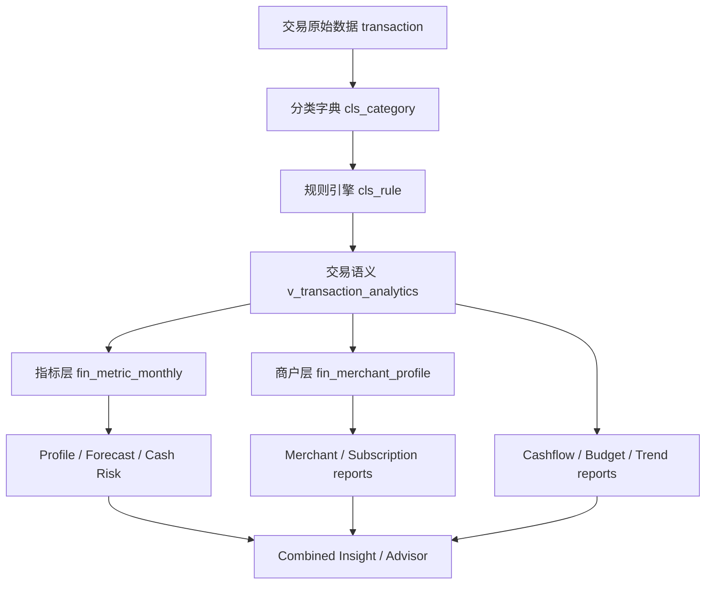

# FinSight v1.8 数据基础驱动版本计划

日期：2026-06-18
目标版本：v1.8.0 / v1.8.1 / v1.9.0
范围：Categories、Rule Engine、基础交易语义、SQL 数据审计、报表准确性。

## 1. 核心判断

当前项目已经不是缺少报表或页面的问题。最新代码已经具备：

- 分类管理：`Admin / Categories` 可以维护收入、固定支出、日常生活、购物、交通、教育、娱乐、报销、资产、负债、投资、理财、手续费、其它消费等层级。
- 规则引擎：`Admin / Rule Engine` 已有分类树、规则列表、active/off/orphaned/invalid 状态、keyword 搜索、未分类关键词建议。
- 报表体系：Cashflow、Budget vs Actual、Spending Drift、Trend Changes、Annual Outlook、Cash Risk、Merchant reports、Unified Drilldown。
- 数据基础：`transaction`、`cls_category`、`cls_rule`、`cls_rule_tag`、`v_transaction_analytics`、`fin_metric_monthly`、`fin_merchant_profile`。

下一阶段的重点应该从“新增功能”转为“基础数据治理驱动上层业务准确性”：

如果分类、规则、商户 token、交易方向、固定/可变口径不清晰，上层报表只会把错误放大。因此 v1.8 应定义为 Data Foundation Release。

## 1.1 v1.8 版本边界

v1.8 不应该优先改报表 UI，也不应该继续增加新的报表入口。v1.8 要先把底层分类和规则数据做准，再让报表基于稳定口径升级。

本版本只做三件事：

1. 重新梳理 Categories：增加必要的二级分类，调整模糊分类，减少“其它消费”承载过多交易。
2. 治理 Rule Engine：清理 orphan / invalid / duplicate / broad keyword，补齐高频未分类交易规则。
3. 建立安全变更机制：任何分类或规则调整都先 SQL 审计、影响预览、dry-run，再批量应用和重算指标。

本版本暂不做：

- 不新增新的业务报表。
- 不引入复杂 AI 分类。
- 不直接覆盖大量历史交易。
- 不删除历史分类，只允许 soft-delete、merge、alias、archive。
- 不让上层报表自己猜测分类口径。

v1.8 完成后，再进入 v1.8.1 / v1.9 做报表和功能改进。

## 1.2 分类调整原则

分类调整必须遵守这些原则，避免底层数据变更造成报表错误：

- **稳定 code 优先**：分类名称可以改，`code` 尽量不改；如果必须改 code，需要 alias/迁移记录。
- **先映射再迁移**：新增分类后，先建立规则和 dry-run，不立即批量改历史交易。
- **先二级分类后报表**：一级分类服务报表主口径，二级分类服务明细分析，不能为了某个报表临时加一级分类。
- **转账、退款、报销、资产、负债、投资必须和消费区分**：这些不是普通支出，否则现金流、预算和趋势会被污染。
- **其它消费只做兜底**：其它消费金额占比过高时，报表应降低可信度，并引导补规则。
- **每个分类要有 owner 语义**：分类必须能说明它影响哪些报表，例如预算、现金流、固定支出、资产变动、负债变动、税费、投资。
- **任何批量变更必须可回滚**：变更前保存交易 id、旧分类、新分类、原因、操作者和时间。

## 1.3 建议分类结构

当前一级分类方向正确，但要补齐二级分类，并把容易混淆的资金流分开。建议 v1.8 使用如下目标结构作为校准标准。

### 收入

- 工资薪金：工资、奖金、津贴、补贴。
- 副业经营：兼职、副业、服务收入。
- 投资收益：利息、分红、基金/股票收益。
- 报销入账：公司报销到账，但不计入真实收入增长。
- 退款返还：消费退款、押金退回、平台返现，不计入收入趋势。
- 其他收入：无法归类但确认为收入。

### 固定支出

- 房租/房贷。
- 物业/水电燃气。
- 通信网络。
- 保险。
- 会员订阅。
- 教育固定缴费。
- 固定还款。
- 其他固定支出。

### 日常生活

- 餐饮堂食。
- 外卖。
- 超市便利。
- 日用品。
- 医疗药品。
- 宠物。
- 家政维修。

### 购物与耐用品

- 服饰美妆。
- 数码家电。
- 家居家装。
- 母婴儿童。
- 大件耐用品。
- 电商购物。

### 交通与车辆

- 公共交通。
- 打车/网约车。
- 油费/充电。
- 停车。
- 保养维修。
- 车辆保险。
- 机票/火车。

### 娱乐与旅行

- 酒店住宿。
- 景点门票。
- 电影演出。
- 游戏娱乐。
- 旅游消费。
- 运动健身。

### 人情与公益

- 红包礼金。
- 转账赠与。
- 公益捐赠。
- 家庭支持。

### 报销与返还

- 公司报销。
- 消费退款。
- 押金返还。
- 平台返现。
- 信用卡退货。

### 资产变动

- ATM 取现。
- 账户间转入转出。
- 余额调整。
- 储蓄转入。
- 资产购买。

### 负债变动

- 信用卡还款。
- 借款收到。
- 贷款还款。
- 分期还款。
- 利息支出。

### 投资活动

- 基金申购。
- 基金赎回。
- 股票买入。
- 股票卖出。
- 证券转账。

### 理财与金融产品

- 银行理财申购。
- 银行理财赎回。
- 货币基金。
- 定期存款。
- 结构性产品。

### 金融手续费

- 银行手续费。
- 信用卡年费。
- 证券手续费。
- 分期手续费。
- 汇兑手续费。

### 其它消费

- 临时无法归类。
- 低频小额未知商户。
- 待人工确认。

这不是要求一次性全量上线，而是作为 v1.8 分类治理的目标字典。实际实施应先用 SQL 看真实交易分布，再决定哪些二级分类立即创建，哪些延后。

## 2. 当前状态分析

### 2.1 Categories

从截图看，一级分类已经覆盖主要个人金融语义：

- 收入
- 固定支出
- 日常生活
- 购物与耐用品
- 交通与车辆
- 教育与培训
- 娱乐与旅行
- 人情与公益
- 报销与返还
- 资产变动
- 负债变动
- 投资活动
- 理财与金融产品
- 金融手续费
- 其它消费

优势：

- 一级分类已经接近专业个人财务分析的主干。
- 同时覆盖损益类、资产负债类和资金流类，有能力支持现金流、资产变动、负债、投资等不同报表口径。
- 后端 `v_transaction_analytics` 已输出 `category_l1_code/category_l1_name`、`consume_l1/consume_l2`，具备向上汇总能力。

不足：

- 分类页只显示树和编辑表单，没有显示每个分类被多少交易、多少规则、多少金额使用。
- 无法从分类页直接看到分类是否“空分类”“规则不足”“交易异常集中”“上月变化异常”。
- 分类只能人工维护，没有版本号、变更说明、合并预览、影响范围统计。
- `parent_id` 在代码中实际大量使用父级 code，字段名仍叫 parent_id，容易让后续开发误解。
- 分类删除会 soft delete 并停用规则，但缺少“删除前影响预览”：会影响多少交易、多少规则、多少报表金额。

### 2.2 Rule Engine

从截图看，当前规则状态为：

- All rules：451
- Active：426
- Off：25
- Orphaned：24
- Invalid / legacy：6

优势：

- 已经能识别 orphaned 和 invalid/legacy。
- 已经按分类树统计规则数量，例如日常生活 184、固定支出 52、交通与车辆 50。
- 已经有未分类关键词建议入口。
- 后端 `ClassificationRuleValidator` 会把规则 categoryId 标准化为 category code，避免新规则继续写入旧 id。

不足：

- 24 条 orphaned 说明历史分类迁移仍有尾部风险；这些规则即使停用，也代表已有交易或导入逻辑曾经依赖旧分类。
- 规则数量和规则质量没有分开。日常生活 184 条规则多，不一定代表分类准确，可能存在重复、冲突、过宽关键词。
- 规则没有命中率、最近命中时间、近 30 天影响金额、误分类回滚率。
- 规则 priority 只排序，不展示冲突解释；用户不知道同一个交易为什么命中 A 而不是 B。
- 缺少“测试规则影响范围”：新增或修改规则前无法预览会影响多少未分类交易、多少已分类交易。

### 2.3 基础交易语义

现状：

- `transaction` 保留原始字段和分类字段。
- `v_transaction_analytics` 统一方向、金额、分类、商户、退款、转账、固定支出等语义字段。
- Metrics、Profile、Forecast、Merchant Mining、Drilldown 都在使用交易语义层。

重点风险：

- `MerchantMiningService` 使用 `MerchantNormalizer.normalizeToken()` 去除订单号、支付通道、门店号。
- `v_transaction_analytics` 和 `TransactionMapper.xml` 的 drill merchant token 仍使用 `lower(trim(opponent_name/transaction_desc))`。
- 这会导致 Merchant reports 里的稳定 merchantToken 和 drilldown SQL 里的 token 不完全一致。结果是商户报表看起来正确，但点击下钻可能查不全交易。

这类问题必须优先修复，因为它直接影响用户对报表的信任。

### 2.4 报表准确性

最新版本已经完成不少上层优化：

- Transactions server-side sorting 已加入 `TransactionSort`。
- Unified Drilldown 已改为后端 breakdown API，并支持 partial warning。
- Annual Outlook 已有场景输入组件。
- Combined Insight 已把 Profile、Trend、Forecast、Merchant 组合成建议。
- 前端 lint 已经从 error 降到 warning，整体质量明显提高。

剩余问题不在页面数量，而在报表可信度：

- 每个报表是否能说明“数据质量是否足够好”。
- 每个数字是否能追溯到 SQL。
- 分类口径变化后，历史报表是否可比。
- 规则修改后，导入分类结果是否可解释、可回滚。

## 3. 版本计划

### v1.8.0：Classification Foundation

目标：完成分类、子分类和规则引擎数据治理，让底层交易语义可审计、可迁移、可回滚。

v1.8.0 必须交付：

- 分类字典治理：
  - 根据真实交易分布补齐二级分类。
  - 将高金额、高频的“其它消费”拆入明确分类。
  - 将报销、退款、转账、投资、负债、资产变动从普通消费中隔离。
  - 建立分类 alias / merge 记录，避免改名或迁移导致历史报表断裂。
  - 分类删除只允许 soft-delete，并必须保留迁移目标。
- Categories 页面增强：
  - 每个分类显示交易数、金额、最近交易日期。
  - 每个分类显示 active rules、off rules、orphan rules。
  - 每个分类显示未分类候选、其它消费候选。
  - 删除、改名、迁移分类前必须显示影响预览。
- Rule Engine 数据治理：
  - 清理 24 条 orphaned rules。
  - 清理 6 条 invalid / legacy rules。
  - 检测重复 pattern、过宽关键词、冲突优先级。
  - 为高频未分类交易补规则。
  - 规则新增/修改前支持 dry-run 预览。
- SQL 审计固化：
  - `docs/tech/database/classification-data-audit.sql` 作为发布前必跑清单。
  - SQL 结果用于生成分类变更任务，不靠主观猜测。
- 交易语义修复：
  - 统一 merchant token normalization。
  - 修复 Merchant reports 与 drilldown token 不一致风险。
  - 定义 `consume_code` 为分类事实源，清理 `consume_id/consume_name` 漂移。

v1.8.0 不做：

- 不做新的报表入口。
- 不做大规模自动覆盖历史分类。
- 不把 SQL 审计结果直接自动修复，必须人工确认。
- 不让 Rule Engine 自动启用低置信度建议。

验收：

- Orphaned rules 为 0，或全部明确标记 inactive legacy 并有 remark。
- Invalid / legacy 为 0，或全部明确标记 inactive legacy 并有 remark。
- 其它消费金额占比下降，并且剩余部分能解释。
- 每个一级分类至少有交易使用量、规则数量、金额影响。
- 分类迁移前能看到 affected transactions、affected rules、affected amount。
- 规则变更前能看到 matched sample、before/after category、金额影响。
- Merchant report 下钻金额和报表金额一致。
- SQL audit 中分类字段漂移结果可解释或为 0。

### v1.8.1：Report Data Quality Layer

目标：在 v1.8.0 底层分类和规则稳定后，让每个报表显示数据可信度和 SQL 可追溯性。

交付：

- 每个核心报表增加 Data Quality strip：
  - 未分类交易数和金额占比
  - transfer excluded count
  - refund excluded count
  - orphan category transaction count
  - merchant token coverage
  - metrics source：stored metric / report SQL fallback
- Report drilldown 增加 provenance：
  - report id
  - source view
  - filter params
  - aggregate total
  - sample count
  - truncated flag
- SQL 审计查询和 UI 指标字段一一对应。

验收：

- Cashflow、Budget vs Actual、Spending Drift、Trend Changes、Annual Outlook、Cash Risk、Merchant reports 都显示数据质量。
- 当未分类比例过高时，报表给出明确提示：“先修分类，再相信趋势。”
- 任意报表数字可以通过 SQL audit query 复核。

### v1.9.0：Classification Intelligence and Recalculation

目标：让规则和分类变更能够安全地驱动历史数据重算，并把重算结果反馈到报表、画像、预测和 Advisor。

交付：

- 分类规则 impact preview：
  - preview matched unclassified rows
  - preview already classified rows that would change
  - show amount impact by category
- 分类规则 dry-run reclassify：
  - 不直接覆盖历史交易
  - 输出 before/after category
  - 支持用户确认后批量应用
- 分类变更版本化：
  - category taxonomy version
  - rule set version
  - metric refresh version
- 指标重算：
  - 分类/规则变更后标记受影响月份 dirty
  - refresh `fin_metric_monthly`
  - 刷新 merchant profiles
  - 刷新 combined insights

验收：

- 用户修改一个高影响规则前能看到影响范围。
- 用户能安全重算历史月份。
- 报表能显示当前使用的 taxonomy/rule version。

### v2.0：Data-Driven Financial Advisor

目标：让上层 Advisor 不只是展示结论，而是基于可审计的数据链给用户具体指导。

交付：

- Advisor card 展示：
  - 数据质量
  - 分类证据
  - 规则证据
  - 交易样本
  - 预测影响
  - 推荐动作
- 用户反馈进入模型：
  - 接受/忽略建议
  - 标记误分类
  - 标记商户别名
  - 调整预算后跟踪结果
- 预测回测：
  - forecast vs actual
  - category forecast error
  - merchant recurring error

验收：

- 用户能看到“为什么给我这个建议”，并能用交易证据验证。
- 用户执行动作后，后续报表能反映效果。

## 4. P0 Bug 和数据风险

### P0-1. 商户 token 口径不一致

问题：

- Merchant Mining 使用 Java `MerchantNormalizer`。
- Drilldown SQL 使用简单 lower/trim。

影响：

- Merchant Concentration、Subscriptions、Merchant Drift 点击下钻时可能漏交易。
- Combined Insight 引用商户证据时，交易样本可能不完整。

修复：

- 新增数据库侧 normalized token 生成逻辑，或在交易导入/刷新 merchant profile 时写入统一 token。
- `v_transaction_analytics`、`TransactionMapper.drillMerchantBreakdown`、`filterMerchantTokenT`、Merchant reports 全部使用同一 token。

验收：

- 同一 merchantToken 在 Merchant report、Trend Changes、Drilldown、Transactions URL 中返回一致交易集合。

### P0-2. Orphaned rules 需要清零或归档

问题：

- 截图显示 24 条 orphaned rules。

影响：

- 用户看到规则仍存在但目标分类无效。
- 历史迁移后的分类规则质量不可控。

修复：

- 用 SQL 找出 orphan rules。
- 对可映射规则批量迁移到新 category code。
- 对不可映射规则标记 inactive legacy，并写 remark。

验收：

- Rule Engine 的 Orphaned 显示为 0，或只显示已归档 legacy。

### P0-3. Invalid / legacy rules 需要显式处理

问题：

- 截图显示 6 条 invalid/legacy。

影响：

- 无 keyword 的规则不会命中，但会干扰用户理解总规则数。

修复：

- 删除无业务价值规则。
- 或保留为 inactive legacy，并在 remark 记录原因。

验收：

- Invalid / legacy 为 0，或所有行都有明确 remark。

### P0-4. 分类删除/迁移缺少影响预览

问题：

- 当前分类删除会 soft delete 并停用关联规则。
- 迁移方法支持 cascade，但 UI 侧缺少清晰的预览和确认。

影响：

- 可能导致历史交易分类变化、报表跳变、规则 orphan。

修复：

- 删除/迁移前展示：
  - affected transactions
  - affected amount by year/month
  - affected rules
  - affected reports
- 需要二次确认。

验收：

- 用户删除或迁移分类前能知道报表影响。

### P0-5. 分类字段双写一致性

问题：

- 交易中同时存在 `consume_id`、`consume_code`、`consume_name`、`category_code/category_name` 兼容字段。

影响：

- 如果只有部分字段更新，上层报表可能根据不同字段得出不同分类。

修复：

- 定义单一事实源：`consume_code` 为主，`consume_name` 由 `cls_category` join 得出。
- 写操作统一由 service 同步字段。
- SQL 审计长期检查不一致行。

验收：

- 交易分类字段一致性审计为 0。

## 5. P1 功能细化

### P1-0. 安全分类调整工作流

v1.8 的分类调整必须按固定流程执行：

1. **Audit**：运行 SQL 审计，确认未分类、其它消费、orphan rules、invalid rules、字段漂移。
2. **Design**：基于真实交易和金额分布决定新增哪些二级分类。
3. **Create**：新增分类时先 inactive 或只用于新交易，不立即改历史交易。
4. **Map Rules**：新增或调整规则，先 dry-run 看到命中样本。
5. **Preview Migration**：对历史交易生成 before/after 预览。
6. **Apply**：用户确认后批量应用，记录 migration batch id。
7. **Refresh**：刷新 monthly metrics、merchant profiles、combined insights。
8. **Verify**：再次运行 SQL audit，确认报表主口径没有异常跳变。

这个工作流是 v1.8 的核心功能，比新增报表更重要。

### P1-1. Categories 从维护页升级为分类资产页

新增指标：

- Category usage：交易数、金额、最近交易日期。
- Rule coverage：规则数、active 数、最近命中。
- Data quality：未分类金额、orphan transaction、soft-deleted 引用。
- Report impact：影响哪些报表和 KPI。

交互：

- 点击分类显示右侧详情，而不是只有编辑表单。
- 支持 “View transactions”、“View rules”、“View report impact”。
- 删除/迁移必须先进入 impact preview。
- 支持 “Add child category from audit candidate”，从未分类高频词直接创建子分类草案。
- 支持 “Merge into category”，但必须生成迁移预览。

### P1-2. Rule Engine 从规则列表升级为规则质量台

新增指标：

- Rule hit count。
- Last matched date。
- Matched amount last 30/90 days。
- Duplicate keyword。
- Conflicting category。
- Broad keyword risk，例如“支付”“消费”“转账”。
- Wrong direction risk，例如收入分类规则命中支出交易。

交互：

- 新增/编辑规则时可以 test against recent transactions。
- 显示 top candidate rows。
- 支持 dry-run apply。
- 支持规则原因展示：为什么这个规则会赢过其它规则。
- 支持规则影响分层：只影响未分类 / 会覆盖已有分类 / 只影响新导入。

### P1-3. 分类数据模型补强

新增或预留字段：

- `cls_category.aliases` 或独立 `cls_category_alias`：记录旧 code、旧名称、同义词。
- `cls_category.report_role`：例如 income、expense、transfer、refund、asset_move、liability_move、investment、fee。
- `cls_category.budgetable`：是否进入预算。
- `cls_category.cashflow_impact`：是否进入真实现金流。
- `cls_rule.last_matched_at`：最近命中时间。
- `cls_rule.hit_count`：命中次数。
- `cls_rule.impact_amount_90d`：近 90 天影响金额。
- `classification_migration_batch`：批量迁移审计记录。

这些字段可以分阶段实现，但 v1.8 需要先在设计上明确，避免后面报表继续写硬编码。

### P1-4. SQL 数据审计进入日常流程

新增脚本：

- `docs/tech/database/classification-data-audit.sql`

用途：

- 发布前手动执行。
- 数据迁移前后对比。
- 分类调整前评估影响。
- 后续可接入 `/api/v1/maintenance` 或 GitHub Actions。

### P1-5. 报表数据质量提示

每个报表显示：

- Data coverage。
- Classification coverage。
- Transfer/refund exclusion。
- Source view。
- Metrics reconciliation status。

当数据质量不足时：

- 降低 insight confidence。
- 直接提示用户先打开 Rule Engine 或 Transactions 未分类视图。

注意：报表数据质量提示属于 v1.8.1，不应阻塞 v1.8.0 的分类治理上线。

## 6. 可执行工作计划

### Sprint 1：数据审计和分类设计

周期：1-2 天
目标版本：v1.8.0-beta.1

任务：

- 执行 SQL audit。
- 导出未分类 Top 100、高金额其它消费 Top 100、规则 orphan/invalid 清单。
- 设计 v1.8 二级分类增补清单。
- 定义每个新增分类的 report role：预算、现金流、资产、负债、投资、退款、转账。
- 找出交易分类字段不一致行和 merchant token 下钻不一致样本。

输出：

- 数据质量基线。
- 分类新增/调整清单。
- 规则修复清单。
- 审计 SQL 固化到仓库。

### Sprint 2：分类字典和规则清理

周期：3-5 天
目标版本：v1.8.0-beta.2

任务：

- 增加或调整二级分类。
- 将可映射 orphan rules 迁移到新 category code。
- 将无法映射的 orphan / invalid rules inactive legacy。
- 补齐高频未分类规则。
- 检测 duplicate / broad / conflicting rules。

输出：

- Orphaned/invalid 风险收敛。
- “其它消费”承载减少。
- 新规则不直接覆盖历史交易。

### Sprint 3：影响预览和安全迁移

周期：2-4 天
目标版本：v1.8.0-rc.1

任务：

- Categories 增加 usage/impact 面板。
- Rule Engine 增加 dry-run preview。
- 删除/迁移分类前增加 impact preview。
- 批量历史重分类必须生成 migration batch。
- Apply 后刷新 metrics 和 merchant profiles。

输出：

- 分类和规则变更可评估、可回滚。
- 避免基础数据变更造成报表突变。

### Sprint 4：统一 merchant token 和底层语义

周期：3-5 天
目标版本：v1.8.0

任务：

- 统一 merchant token normalization。
- 更新 `v_transaction_analytics` 和 drill SQL。
- 增加 merchant token 一致性测试。
- 回归 Merchant reports、Trend Changes、Unified Drilldown。
- 固化 `consume_code` 为分类事实源。

输出：

- 商户报表和下钻交易一致。
- 底层交易语义稳定。

### Sprint 5：报表数据质量层

周期：3-5 天
目标版本：v1.8.1

任务：

- 核心报表接入 data quality strip。
- Profile / Forecast / Combined Insight 接入数据质量权重。
- 增加 metric reconciliation 展示或 API。
- 报表下钻显示 source view、filter params、aggregate total。

输出：

- 用户知道什么时候可以信任报表，什么时候必须先修数据。

## 7. SQL 审计清单

脚本：[classification-data-audit.sql](../database/classification-data-audit.sql)（21 项，与代码内 `ClassificationDataAuditCatalog` 一致）

工作流：[classification-governance-workflow.zh-cn.md](../database/classification-governance-workflow.zh-cn.md)  
基线模板：[classification-audit-baseline-template.md](../database/classification-audit-baseline-template.md)  
Issue 看板：[#67](https://github.com/xiaxinyu/finsight/issues/67) · [#68](https://github.com/xiaxinyu/finsight/issues/68) · [v1.8 Data Foundation 标签筛选](https://github.com/xiaxinyu/finsight/issues?q=label%3Aarea%3Adata+)

覆盖：

- 分类树健康。
- orphaned / invalid rules。
- duplicate patterns / broad keywords。
- rule/category usage。
- 交易未分类率、其它消费 Top 100。
- 交易分类字段一致性。
- 报表聚合口径。
- merchant token 覆盖与样本。
- fixed/variable 口径。
- refund/transfer 排除口径。
- **§20 汇总计数**（before/after 对比）。

建议每次分类大调整前后执行一次，并保存结果到 baseline 模板。

## 8. GitHub Issue 拆分建议

当前跟踪（2026-06）：

| # | Issue |
|---|-------|
| 67 | [SQL 审计基线与治理工作流](https://github.com/xiaxinyu/finsight/issues/67) |
| 68 | [执行审计并产出修复清单](https://github.com/xiaxinyu/finsight/issues/68) |
| 62–66 | merchant token / orphan / invalid / field drift / impact preview |
| 69–73 | 二级分类 / 八步工作流 / Categories 资产页 / 规则质量 |
| 75–77 | migration batch / Data Quality strip |

历史拆分参考：

1. `docs(data): define v1.8 category taxonomy and audit workflow`
2. `fix(classification): resolve orphaned and invalid legacy rules`
3. `feat(categories): add category usage and rule coverage panel`
4. `feat(categories): add category impact preview before delete or merge`
5. `feat(rules): detect duplicate broad and conflicting rules`
6. `feat(rules): add dry-run preview before rule changes`
7. `fix(data): audit and repair transaction category field drift`
8. `fix(classification): normalize merchant token contract for reports and drilldown`
9. `feat(data): add classification migration batch audit trail`
10. `feat(reports): add data quality strip to core reports after taxonomy stabilization`

## 9. Definition of Done

v1.8.0 完成标准：

- `npm test` 通过。
- `npm run lint` 无 error。
- `mvn test` 通过。
- `mvn checkstyle:check` 通过。
- Orphaned rules 为 0，或全部明确 inactive legacy。
- Invalid rules 为 0，或全部明确 inactive legacy。
- v1.8 二级分类清单已落地，或明确标注延期原因。
- 未分类交易金额占比可见，并低于本次版本设定阈值。
- 其它消费金额占比可见，并低于本次版本设定阈值。
- 分类删除/迁移必须有影响预览。
- 规则新增/修改必须有 dry-run 预览。
- Merchant report 下钻金额和报表金额一致。
- 分类或规则变更前可以看到影响范围。

v1.8.1 完成标准：

- 每个核心报表显示 data quality。
- 报表 insight 根据分类覆盖率和数据质量调整 confidence。
- 报表下钻显示 source view、filter params、aggregate total、sample count。
- 用户能从报表直接跳到需要修复的分类、规则或未分类交易。
