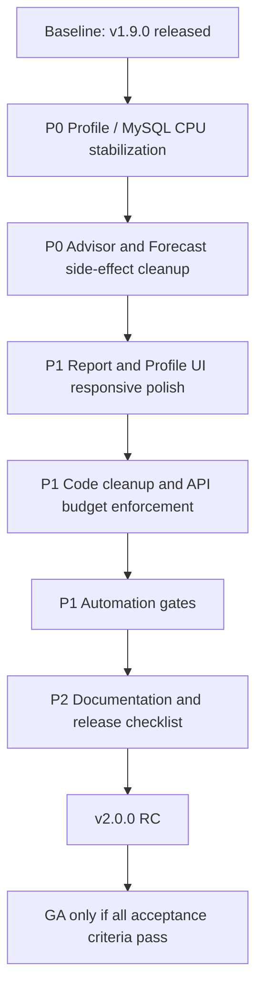

# FinSight v2.0.0 稳定化与质量提升计划

日期：2026-06-23
目标版本：v2.0.0
版本定位：Stability, Performance, UI Quality, Documentation Release
范围：现有功能维护、性能优化、界面和布局优化、屏幕自适应、自动化质量门禁、文档补齐。

## 1. 版本原则

v1.9.0 已经完成一轮功能扩展，但也引入了复杂度和性能风险。v2.0.0 不应继续增加新业务功能，而应把当前能力稳定到可以长期维护、可验证、可上线的状态。

v2.0.0 只做四类工作：

- **性能稳定**：Profile、Advisor、Forecast、报表查询必须有缓存、索引、慢查询审计和明确响应时间预算。
- **代码稳定**：清理重复调用、隐藏写入、副作用、fallback 重算和缺少边界控制的问题。
- **界面稳定**：优化现有页面的布局、交互密度、移动端适配和表格可读性，不新增业务入口。
- **工程稳定**：补齐 CI、自动化检查、文档、运维手册和发布验收清单。

本版本明确不做：

- 不新增新的报表类型。
- 不新增新的 Profile 维度。
- 不新增复杂 AI 功能。
- 不改变分类和规则引擎的业务边界，除非为了修复数据准确性或性能问题。
- 不把性能问题用扩大数据库规格来掩盖。

## 2. 当前高风险判断

### 2.1 Profile 会导致 MySQL CPU 飙高

`FinancialProfileService.currentProfile()` 当前是高风险入口。一次 `/api/v1/analytics/profile` 请求会串联执行：

- 读取 12 个月指标，并在 reconciliation gate fallback 时调用 `historyFromReports()` 逐月重算报表指标。
- 调用 `wealthService.snapshot()`、`cashflowService.metrics()`、`dataQualityService.summary()`。
- 通过 `v_transaction_analytics` 聚合 12 个月支出集中度。
- 每次 GET 请求都会写入 `fin_profile_snapshot` 的 10 个维度快照。

这会造成三个问题：

- **读请求带写副作用**：刷新页面、React Query 重新拉取、Advisor 间接调用都会写入快照。
- **计算链路重复**：Profile 页面加载 Profile，同时 `CombinedInsightPanel` 又请求 Advisor；Advisor 会再次调用 Profile、Trend、Forecast、Merchant 等服务。
- **fallback 放大成本**：当 stored metrics gate 不通过时，Profile 和 Forecast 可能回退到 report SQL，并按月重算，MySQL CPU 会被放大。

涉及代码：

- `src/main/java/com/finsight/application/analytics/FinancialProfileService.java`
- `src/main/java/com/finsight/application/analytics/CombinedInsightService.java`
- `src/main/java/com/finsight/application/analytics/RecommendationService.java`
- `src/main/java/com/finsight/application/analytics/MetricMonthlyService.java`
- `frontend/src/pages/Profile/index.tsx`
- `frontend/src/components/CombinedInsightPanel.tsx`

### 2.2 Advisor / Combined Insight 查询链路过重

`RecommendationService.topRecommendations()` 会先调用 `combinedInsightService.topCombinedCards(5)`，而 `CombinedInsightService.buildCombinedCards()` 会串联 Profile、Trend、Forecast、Merchant subscription、Merchant concentration。若卡片不足，还会再次调用 Profile 和 Forecast。

这导致 Dashboard、Profile 和其他引用推荐卡片的页面可能触发多条重型链路。v2.0.0 必须把 Advisor 从“实时全量计算”改成“读缓存结果，必要时后台刷新”。

### 2.3 Forecast 有持久化副作用

`ForecastService.forecast()` 每次请求都会创建 `fin_forecast_run` 并写入 forecast lines。作为 GET 报表接口，这会造成数据表膨胀、写入放大和重复计算。v2.0.0 应把 Forecast 拆分为 read-only preview 和 explicit save/run 两类语义。

### 2.4 UI 已具备功能，但还不是稳定产品体验

Profile 页面当前展示了 Overall、Radar、10 个维度卡片和 Combined Insight，但还有稳定性问题：

- 信息密度不均衡，桌面端可用但移动端容易变长、滚动成本高。
- Radar、维度卡片、Advisor 卡片在同屏内竞争注意力。
- 卡片高度和 evidence 文案长度不稳定，容易造成网格错位。
- 当前交互依赖 Drawer，但没有统一的“摘要、证据、行动、历史趋势”阅读节奏。

v2.0.0 应优化已有页面和组件，不新增功能入口。

### 2.5 自动化门禁不足

当前 CI 已有 backend test、Flyway migration test、checkstyle、frontend test、lint、build。但还缺少：

- Profile / Advisor / Forecast 性能回归测试。
- MySQL explain / slow query 审计。
- 前端响应式截图检查。
- Bundle size 和页面渲染耗时预算。
- 文档完整性和发布清单校验。

## 3. v2.0.0 工作流总图

## 4. 详细行动计划

### 4.1 P0：Profile 性能与 MySQL CPU 修复

目标：Profile 页面和相关 Advisor 调用不能再触发重型实时全量计算，也不能让普通 GET 请求持续写数据库。

执行任务：

- 给 `/api/v1/analytics/profile` 建立明确的性能预算：warm cache P95 小于 800ms，cold cache P95 小于 2s。
- 把 `currentProfile()` 拆成 read-only 计算和 snapshot persistence 两个明确方法。
- 默认 GET `/profile` 只读缓存或只读已计算结果；快照写入改为每日一次、指标版本变化时触发，或通过后台任务触发。
- Profile 结果增加短 TTL 缓存，建议 5 到 15 分钟，cache key 至少包含 `userId`、`asOfDate`、`metricVersion`。
- 对 Advisor 调用 Profile 的场景使用同一份缓存结果，禁止在一次页面加载中重复计算。
- 禁止 `historyFromReports()` 成为常态路径。若 metrics gate 不通过，应展示数据可信度警告，并触发后台修复任务，而不是在用户请求中逐月重算。
- 将 `loadConcentrationStats()` 从 `date_format(v.txn_date, '%Y-%m') between ? and ?` 改为可走索引的日期范围查询。
- 针对 `transaction` 高频查询补齐或验证索引：`created_by, deleted, transaction_date`、`consume_code`、`txn_kind`、`bank_card_id`。
- 对 `v_transaction_analytics` 的高频聚合建立等价的基础表查询或预聚合指标，避免 view + function + join 在热点路径中反复执行。
- 增加 Profile slow query 日志采集脚本，输出 explain、扫描行数、耗时和建议索引。

验收标准：

- 连续刷新 Profile 20 次，MySQL CPU 不出现持续高于 50% 的平台。
- `/api/v1/analytics/profile` warm cache P95 小于 800ms，P99 小于 1.5s。
- Profile GET 请求在 warm cache 命中时不写入 `fin_profile_snapshot`。
- `fin_profile_snapshot` 每个用户每天每个维度最多 1 条有效更新。
- Profile 链路中没有 `date_format(column)` 形式的过滤条件出现在热点 SQL。
- slow query log 中 Profile 相关查询单次耗时小于 500ms，扫描行数有解释和上限。

### 4.2 P0：Advisor / Combined Insight 降载

目标：Dashboard、Profile 和报表页面的 Advisor 区域必须读轻量结果，不再每次实时串联全部重型服务。

执行任务：

- 为 Advisor cards 建立缓存或预计算表，GET `/api/v1/advisor/recommendations` 默认读取最近结果。
- `CombinedInsightService.buildCombinedCards()` 只允许后台刷新或显式刷新调用使用。
- 在一次请求内增加 request-scope memoization，Profile、Forecast、Trend、Merchant 结果不能重复计算。
- 卡片不足时不再二次调用 Profile / Forecast；改用已计算的上下文。
- 对 `fin_insight_card` 做去重或 upsert，避免每次推荐请求都追加重复卡片。
- 增加 Advisor 性能预算和日志：记录是否命中缓存、是否触发重算、每个子模块耗时。

验收标准：

- Dashboard 首屏和 Profile 页面同时加载时，Advisor 不触发 Profile 的第二次完整计算。
- `/api/v1/advisor/recommendations` warm cache P95 小于 500ms。
- 连续刷新 20 次，`fin_insight_card` 不出现重复膨胀。
- 日志可以看到 Advisor 每个子模块耗时，超过预算时有 warn。

### 4.3 P0：Forecast 读写语义修复

目标：Forecast 报表查询默认只读，不因为用户查看页面而不断写入 forecast run。

执行任务：

- 将 forecast preview 和 persisted run 分开：GET 只返回 preview；POST 或 explicit action 才保存 run。
- 对已有 GET 调用保留兼容返回结构，但避免默认写入 `fin_forecast_run` 和 `fin_forecast_line`。
- 给 `fin_forecast_run` 增加保留策略，清理旧的重复运行记录。
- Forecast 使用 stored metrics 为主；fallback 只用于人工诊断或后台修复。
- `categoryForecasts()` 不应通过完整 `forecast()` 再拆结果，避免重复写入和重复计算。

验收标准：

- 打开 Annual Outlook / Forecast 页面 10 次，不新增无意义 forecast run。
- Forecast GET P95 小于 1s，复杂数据 cold path P95 小于 2.5s。
- 旧 forecast run 有清理脚本和回滚说明。

### 4.4 P1：报表与 Profile UI 稳定化

目标：不增加新页面，只把现有页面做到专业、清晰、稳定、适配。

执行任务：

- Profile 页面重排为三层信息架构：顶部健康摘要，中部维度矩阵，底部证据和行动详情。
- Combined Insight 在 Profile 页面默认使用紧凑模式，避免压过个人画像主内容。
- 维度卡片固定最小高度和证据行数，长文案用 tooltip 或 drawer 展示。
- Radar 在移动端改为更适合阅读的维度列表或横向条形评分，避免小屏难以点击。
- Drawer 统一为“评分解释、核心证据、关联交易/报表、建议行动、历史趋势”结构。
- Tables 增加稳定布局规则：固定表头、列宽策略、空态、加载态、错误态、横向滚动提示。
- Transactions / Detail 表格增加视觉层次优化：金额、方向、分类、账户、商户、日期必须可快速扫描。
- 所有核心页面检查 360、390、768、1024、1440、1920 宽度，不允许文字重叠、按钮溢出、图表空白。
- 图表高度使用响应式约束，不允许随内容抖动导致布局跳变。

验收标准：

- Profile、Dashboard、Reports、Transactions Detail 在 360px 到 1920px 宽度下无横向页面级溢出。
- 所有图表加载后非空白，移动端图表不遮挡标题和按钮。
- 表格列在移动端有可预期的横向滚动或优先级折叠，不出现压缩到不可读。
- 主要操作按钮和筛选区在移动端可点击区域不小于 40px。
- Playwright 或等价截图检查覆盖至少 5 个视口。

### 4.5 P1：代码质量与边界整理

目标：降低后续维护成本，让性能和行为可推理。

执行任务：

- 明确每个 service 的读写边界，禁止 read API 隐式持久化。
- 为重型 service 增加统一耗时日志和预算注解或 helper。
- Profile、Advisor、Forecast 使用统一的 `MetricSnapshot` 或只读 DTO，减少 Map 字符串 key 传递错误。
- 整理 fallback 策略：用户请求只展示 fallback 状态；后台任务负责修复 metrics。
- 为关键 SQL 增加 repository 层方法和测试，减少 controller/service 内裸 SQL 扩散。
- 梳理异常处理：性能降级、数据不足、metrics gate blocked、缓存 miss 应有明确响应。
- 消除前端重复请求：设置合理 `staleTime`、`gcTime`，统一 query key，页面切换不应立即重算重型数据。

验收标准：

- Profile、Advisor、Forecast 的 read endpoint 没有默认写入副作用。
- 关键服务单元测试覆盖正常、数据不足、fallback、缓存命中、缓存未命中。
- 前端打开 Profile 页面时，Network 中 Profile 和 Advisor 不重复触发相同重型 API。
- 新增或修改代码通过 checkstyle、frontend lint、test、build。

### 4.6 P1：自动化与性能门禁

目标：让性能、响应式和文档质量进入 CI，而不是靠人工记忆。

执行任务：

- CI 保留现有 backend-test、backend-flyway、backend-style、frontend-test、frontend-lint、frontend-build。
- 将 frontend lint 从“允许 exit 1”逐步收紧为真正失败；如果暂时不能一次修完，建立 lint debt baseline。
- 增加 backend performance smoke test：Profile、Advisor、Forecast 在 seed data 上必须低于预算。
- 增加 MySQL migration smoke：检查关键索引存在、关键 explain 不出现全表扫描。
- 增加 Playwright 响应式截图 smoke：Profile、Dashboard、Transactions Detail、Reports 关键页面。
- 增加 bundle size 检查，避免图表和 UI 依赖导致前端体积持续膨胀。
- 增加文档链接检查，确保 roadmap、database、release notes、ops docs 可导航。

验收标准：

- Pull Request 必须通过 backend test、Flyway、frontend test、frontend build。
- 性能 smoke 失败时阻止合并。
- 响应式截图失败时阻止合并或必须有明确豁免说明。
- 文档检查可以发现失效内部链接。

### 4.7 P2：文档与运维手册

目标：v2.0.0 发布后，用户和维护者知道如何诊断、回滚和验证。

执行任务：

- 编写 `Profile Performance Runbook`：如何打开 slow query log、如何看 explain、如何确认缓存命中。
- 编写 `v2.0.0 Release Checklist`：功能冻结、数据库迁移、性能基线、UI 截图、文档检查、回滚步骤。
- 更新 `FEATURE_FLAGS.md`：明确 Profile、Advisor、Forecast、Merchant Mining 的性能影响和推荐生产配置。
- 更新 `REPORT_UI.md`：补齐表格、图表、移动端、空态、错误态规范。
- 编写 `Known Issues from v1.9.0`：列出 v2.0.0 必须关闭的问题，不再模糊表达“体验不好”。
- 为运维提供 MySQL 索引和清理脚本说明，包括 forecast run、insight card、profile snapshot。

验收标准：

- 新成员可以只看文档完成 Profile CPU 问题排查。
- 发布前 checklist 每一项都有 owner、命令或证据链接。
- 文档覆盖功能开关、性能基线、回滚路径和常见故障。

## 5. 建议版本节奏

### v2.0.0-alpha.1：性能基线和问题锁定

- 完成 Profile / Advisor / Forecast 链路耗时日志。
- 输出 slow query baseline 和 explain baseline。
- 建立 seed data 性能 smoke。
- 冻结 v2.0.0 功能范围。

通过条件：

- 能复现并量化 Profile CPU 问题。
- 确认最慢 10 条 SQL、调用次数和来源页面。
- 所有 P0 issue 有 GitHub issue 和 owner。

### v2.0.0-beta.1：Profile CPU 修复

- Profile 缓存落地。
- GET 请求去写副作用。
- Advisor 复用缓存 Profile。
- 热点 SQL 改写并补索引。

通过条件：

- 连续刷新 Profile 不再造成 CPU 持续飙高。
- Profile warm cache P95 达标。
- 快照写入频率受控。

### v2.0.0-beta.2：Advisor / Forecast 降载

- Advisor 默认读取预计算或缓存结果。
- Forecast GET 变为 read-only preview。
- insight cards 和 forecast runs 不再重复膨胀。

通过条件：

- Dashboard + Profile 同时加载时没有重复重型计算。
- Forecast GET 不再新增无意义持久化记录。

### v2.0.0-rc.1：UI 与响应式验收

- Profile、Dashboard、Reports、Transactions Detail 完成响应式检查。
- 表格和图表布局稳定。
- Playwright 截图 smoke 加入 CI。

通过条件：

- 5 个视口截图无明显布局错误。
- 表格无不可读压缩，图表无空白。

### v2.0.0 GA：发布候选稳定

- 自动化门禁通过。
- 文档和 runbook 完成。
- v1.9.0 known issues 全部关闭或转为明确后续版本。

通过条件：

- 连续 3 次全量 CI 通过。
- 性能基线达标。
- 发布 checklist 全部完成。

## 6. GitHub Issue 拆分建议

建议把 v2.0.0 拆成以下 issue，全部挂到 `v2.0.0` milestone。

| 优先级 | Issue | 验收重点 |
| --- | --- | --- |
| P0 | Profile GET removes write side effects | warm cache 命中时不写 `fin_profile_snapshot` |
| P0 | Profile result cache and request memoization | Profile P95 达标，Advisor 复用结果 |
| P0 | Rewrite Profile concentration SQL and add indexes | 无热点 `date_format(column)`，explain 可接受 |
| P0 | Advisor recommendations read from cached/precomputed context | Advisor P95 小于 500ms |
| P0 | Forecast GET becomes read-only preview | 打开报表不产生重复 forecast run |
| P1 | Add performance smoke tests for Profile/Advisor/Forecast | CI 能阻止性能回归 |
| P1 | Responsive QA for Profile/Dashboard/Reports/Transactions Detail | 5 个视口截图通过 |
| P1 | Standardize table layout and visual scanning for Transactions Detail | 金额、分类、商户、日期清晰可读 |
| P1 | Tighten frontend query caching and staleTime | 页面切换不重复重算 |
| P1 | Reduce lint debt and make frontend lint fail on violations | lint 不再软失败 |
| P2 | Add Profile performance runbook | 可按文档排查 MySQL CPU |
| P2 | Add v2.0.0 release checklist and rollback guide | 发布证据完整 |

## 7. 最终发布验收标准

v2.0.0 只有在以下条件全部满足时才能发布：

- Profile、Advisor、Forecast 的 P0 性能问题全部关闭。
- MySQL CPU 在高频刷新 Profile、Dashboard、Advisor 时不持续高于 50%。
- Profile warm cache P95 小于 800ms，Advisor warm cache P95 小于 500ms，Forecast GET P95 小于 1s。
- GET 类报表接口没有默认写入副作用。
- `fin_profile_snapshot`、`fin_forecast_run`、`fin_insight_card` 不因页面刷新而重复膨胀。
- Profile、Dashboard、Reports、Transactions Detail 通过 360、390、768、1024、1440、1920 视口检查。
- CI 覆盖 backend test、Flyway migration、checkstyle、frontend test、frontend lint、frontend build、性能 smoke、响应式截图 smoke。
- 文档包含性能 runbook、发布 checklist、回滚说明、功能开关说明。
- v1.9.0 已知问题全部被关闭、验证，或明确转入 v2.0.1 且不影响 GA。

## 8. 结论

v2.0.0 应定义为 FinSight 的稳定化主版本，而不是功能扩展版本。当前最重要的问题不是再做更多报表，而是保证 Profile、Advisor、Forecast、Transactions Detail 和核心报表在真实数据量下稳定、准确、可维护。

只有当底层查询、缓存、快照、自动化和响应式体验都被纳入验收标准，FinSight 才能从“功能多”进入“可信、专业、可持续使用”的阶段。
