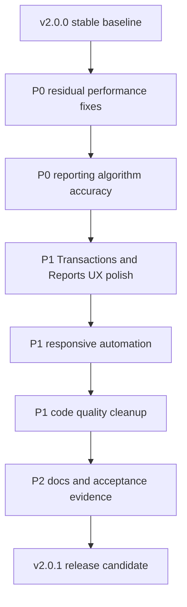

# FinSight v2.0.1 质量优化与报表体验计划

日期：2026-06-24
目标版本：v2.0.1
版本定位：Quality Optimization, Reporting Accuracy, UX Polish, Responsive Reliability
范围：代码质量、界面布局、报表功能细化、算法准确性、页面交互和易用性、屏幕自适应、文档、自动化质量门禁。

## 1. 版本判断

v2.0.0 已经完成了稳定化主线的关键落地，质量比 v1.9.0 明显提升：

- Profile GET 已改为 read-only 缓存路径，不再默认写 `fin_profile_snapshot`。
- Profile 快照刷新已拆到 `POST /api/v1/analytics/profile/snapshots/refresh`。
- Advisor 已加入缓存，`RecommendationService` 不再每次直接写 `fin_insight_card`。
- Forecast GET 已改为 preview，持久化只保留在 explicit scenario 路径。
- 前端 Profile 已做三层布局、移动端维度条形展示、统一 React Query staleTime。
- CI 已新增 backend performance job、frontend bundle job、doc links job。
- 运维侧已有 Profile performance runbook、release checklist、known issues、slow query audit 和 analytics P95 smoke。

但 v2.0.0 仍属于“把高风险止住”的版本，不代表产品体验、报表算法、界面细节和自动化覆盖已经达到稳定产品级。v2.0.1 应定义为“质量优化版本”，只完善当前功能，不扩展新功能。

v2.0.1 的目标不是让 FinSight 看起来功能更多，而是让现有功能更准、更快、更好用、更容易验收。

## 2. v2.0.1 版本边界

本版本做：

- 修复 v2.0.0 遗留的性能风险和 SQL 可索引性问题。
- 优化 Profile、Transactions、Reports、Annual Outlook、Cash Risk、Trend Changes 的 UI、布局和交互。
- 提高 Forecast、Trend、Profile scoring、report insight 的算法可信度。
- 补齐响应式截图自动化、关键页面浏览器 smoke、API 性能 smoke。
- 清理复杂 service 中的 Map 传递、重复逻辑、隐式 fallback 和难测代码。
- 完善用户文档、运维文档、报表口径文档和 release checklist。

本版本不做：

- 不新增新的大模块。
- 不新增新的报表入口。
- 不引入外部 AI 依赖。
- 不重做分类体系。
- 不改变当前 URL / API 兼容性，除非是 bug fix 且有迁移说明。
- 不通过扩大 MySQL 规格掩盖查询和缓存问题。

## 3. 当前质量评估

### 3.1 已完成质量较好的部分

Profile 主链路已经从 v1.9.0 的“GET 同步计算 + 写快照”变成 v2.0.0 的“request memo + TTL cache + explicit snapshot refresh”。这是正确方向。

Forecast 主链路已经从“GET 生成持久化 run”变成 “GET preview + POST scenario persist”。这消除了页面刷新造成的 forecast run 膨胀。

Advisor 主链路已经增加缓存，并复用 `CombinedInsightContext`，避免卡片不足时再次计算 Profile / Forecast。

Profile 页面已经有更清晰的信息层级：summary、dimension matrix、compact insights、dimension drawer。移动端 Radar 也有替代的维度评分列表。

CI 已经从基本 test/build 扩展到 performance、bundle、doc links，方向正确。

### 3.2 v2.0.1 必须继续修的不足

仍然存在以下不足：

- Forecast 分类预测 SQL 仍使用 `date_format(v.txn_date, '%Y-%m')` 做 group，虽然过滤已改日期范围，但 group 表达式仍可能加重热点聚合成本。
- Trend 商户趋势查询使用 `year(v.txn_date) = ?`，这是典型不可索引过滤，应改为日期范围。
- Forecast 算法仍以固定 seasonal sine factor 和 rolling average 为主，准确性缺少足够 backtest 驱动。
- `ForecastBacktestService` 依赖历史中存在 `INCOME_FORECAST` / `EXPENSE_FORECAST` 指标，但 GET preview 不再持久化后，backtest 样本可能为空或偏弱。
- `MetricMonthlyService.historyFromReports()` 仍保留逐月 report SQL fallback，虽然 Profile / Forecast 已不再走，但应封装为 diagnostic-only，避免后续误用。
- `CombinedInsightService` 仍在 cache miss 时串联 Profile、Trend、Forecast、Merchant 多个重型服务，需要进一步区分页面即时结果和后台预计算结果。
- Transactions 页面功能强但复杂，筛选、表格、编辑、批量操作、自动分类在同一页面内耦合较重，移动端和窄屏体验仍需严查。
- `FsDataTable` 和 ProTable 混用，报表表格体验和交易明细表格体验还没有统一质量标准。
- 当前 CI 还没有真正打开浏览器做核心页面响应式截图和交互 smoke。
- 文档已有，但还需要把“报表口径、算法、准确性验收、数据质量影响”写清楚。

## 4. v2.0.1 总体路线

## 5. P0：剩余性能风险修复

目标：v2.0.1 不能重新引入 Profile / Advisor / Forecast / Report 热点查询，MySQL CPU 不应再因为分析页面刷新而持续升高。

### 5.1 SQL 可索引性收口

执行任务：

- 将 `TrendAnalysisService.merchantSpendByYear()` 中 `year(v.txn_date) = ?` 改为 `v.txn_date >= ? and v.txn_date < ?`。
- 审计所有 analytics 热点 SQL，禁止在 `where` 条件中对日期列使用 `year()`、`month()`、`date_format()`。
- Forecast 分类历史聚合改为按日期范围读取后在 Java 按 `YearMonth` 聚合，或引入可复用的 monthly metric/category aggregate。
- 对 `CategoryImpactSupport` 中 `date_format(t.transaction_date, '%Y-%m')` 的用途做分级：如果只用于 preview 分组可保留，如果用于过滤必须改日期范围。
- 为 slow query audit 增加 Trend / Forecast / Transactions Detail 的 explain 模板。

验收标准：

- `rg "where.*year\\(|where.*date_format\\(|date_format\\(.*between"` 在生产热点 SQL 中无命中。
- Profile、Advisor、Forecast、Trend、Transactions stats 的 explain 不出现无理由全表扫描。
- Analytics slow query log 在 20 次刷新 smoke 后无超过 500ms 的 Profile / Advisor 查询。
- Forecast category history 和 Trend merchant movers 在 12 到 24 个月数据范围内 P95 小于 800ms。

### 5.2 缓存与失效策略补强

执行任务：

- 明确 Profile、Advisor、Forecast、Trend、Merchant 每类缓存的 TTL、key、失效事件和数据新鲜度说明。
- 交易变更、分类变更、规则应用、metric refresh 后统一触发 analytics cache invalidation。
- 前端 React Query `gcTime` 与后端 TTL 对齐；当前定义了 `ANALYTICS_GC_MS`，需要逐步用于重型 query。
- Advisor cache miss 时增加熔断或降级：任一子服务超时不阻塞整张页面。
- 增加 cache hit ratio 日志，至少覆盖 Profile、Advisor、Forecast。

验收标准：

- 修改交易分类后，Profile / Advisor / Forecast 在下一次显式刷新或 metric refresh 后能看到正确结果。
- 连续打开 Dashboard、Profile、Annual Outlook 时，Profile / Advisor / Forecast 缓存命中率大于 80%。
- 任一子服务超过预算时，页面显示降级卡片，不阻塞整个页面。

### 5.3 Profile CPU 回归保护

执行任务：

- 保留 v2.0.0 的 Profile warm cache P95 预算，并把 `analytics-p95-smoke.sh` 纳入发布前必跑清单。
- 增加 Profile snapshot refresh smoke，验证 `POST /profile/snapshots/refresh` 一次只 upsert 10 个维度。
- 增加数据库行数膨胀检查：`fin_profile_snapshot`、`fin_forecast_run`、`fin_insight_card`。
- 在 Profile 页面增加更清楚的数据更新时间和 degraded metrics 状态，不让用户误以为所有结果实时准确。

验收标准：

- Profile warm cache P95 小于 800ms，cold cache P95 小于 2s。
- 连续刷新 Profile 30 次，`fin_profile_snapshot` 行数不增长。
- 显式刷新快照后，同一用户同一天同一维度仍只有一条有效记录。
- MySQL CPU 在 Profile 30 次刷新 smoke 中不持续高于 50%。

## 6. P0：报表算法准确性优化

目标：报表和 insight 不能只“能显示”，还要有可解释、可回测、可验证的准确性。

### 6.1 Forecast 算法准确性

执行任务：

- 将 Forecast baseline 从单一 rolling average + 固定 seasonal factor，升级为“历史窗口 + 同比季节性 + 最近趋势”的混合模型。
- 使用已完成月份作为 actual，不再对已完成月份生成 forecast label。
- 对数据不足情况明确降级：少于 3 个月只显示低置信度；少于 6 个月不生成趋势判断；少于 12 个月不生成季节性判断。
- Backtest 改为用 historical cut-off 重新生成预测，再与实际值比较，而不是依赖已持久化 forecast metric。
- 增加 MAPE、MAE、bias、coverage 四类指标。
- Forecast confidence 由固定 scenario spread，调整为由 backtest error 和数据质量共同驱动。

验收标准：

- Forecast backtest 最近 6 个月 expense MAPE 小于 25%，income MAPE 小于 20%；如果样本不足，必须显示“不足以评估”。
- Forecast 结果包含 `sampleMonths`、`confidenceLevel`、`errorBandSource`、`dataQualityImpact`。
- 单元测试覆盖正常数据、季节性数据、收入缺失、费用突增、退款/转账排除、样本不足。

### 6.2 Profile scoring 准确性

执行任务：

- Profile 10 维评分补齐权重，不再简单平均；数据质量维度应影响整体可信度，而不是与财务健康维度等权。
- 固定支出、负债压力、流动性安全的阈值要写入文档和测试。
- 数据不足时评分应返回 lower confidence，而不是给出看似确定的高分。
- Evidence 增加来源字段与时间窗口，Drawer 中展示“此评分基于哪些月份/哪些指标”。
- 对 `spending_concentration` 增加 top category 和 top merchant 双视角，避免只看分类导致误判。

验收标准：

- Profile overallScore 由权重表驱动，权重总和为 100%，有单元测试保护。
- 数据不足时 Profile 返回 `confidence: low|medium|high`。
- 每个维度至少有 1 条 evidence，且 evidence 包含 `source`、`ref`、`detail`、`window` 或等价字段。
- 分类未完成或 metrics degraded 时，Profile UI 明确提示准确性下降。

### 6.3 Trend / Insight 准确性

执行任务：

- Trend merchant movers 改为日期范围查询，并验证转账、退款、报销不污染支出趋势。
- Lifestyle inflation 判断增加 minimum amount threshold，避免小额波动导致误报。
- Trend contribution 计算处理 expenseDelta 为 0 或负值的情况，避免贡献率误导。
- Advisor card 的 confidence 不再固定，应由 evidence completeness、data quality、forecast confidence 共同计算。
- Combined Insight 卡片按“影响金额、紧急程度、置信度、可行动性”排序。

验收标准：

- Trend Changes 中没有因为退款/转账产生的异常 top mover。
- lifestyle inflation 单元测试覆盖收入增长、支出增长、支出下降、小额波动四类场景。
- Advisor card 每张都有 confidence 计算来源。
- Advisor 排序在测试数据中可解释、稳定、可复现。

## 7. P1：界面、布局和交互优化

目标：当前功能保持不变，但让页面更清晰、更易用、更适合真实长期使用。

### 7.1 Transactions / Detail 表格体验

执行任务：

- 梳理 Transactions 页面信息架构：顶部 KPI、筛选、active filters、表格、selection bar、edit panel 的层级和间距。
- 移动端将复杂筛选折叠为 drawer 或紧凑 filter bar，避免首屏被筛选控件占满。
- 表格列优先级重新定义：移动端优先显示 Date、Transaction、Amount；Category、Merchant、Card 可折叠到展开详情。
- 行内编辑面板增加明确保存/取消状态、错误提示和变更高亮。
- 批量操作栏固定在表格底部时不遮挡分页和最后一行。
- 自动分类 preview 增加“命中规则、置信度、是否覆盖已有分类”的可读提示。
- 删除、转账、收入/支出转换这类危险操作增加影响摘要。

验收标准：

- 360px 和 390px 宽度下 Transactions 页面无页面级横向溢出。
- 表格在 360px 下仍能快速读出交易时间、描述、金额和方向。
- 批量选择 1、2、10 条记录时 selection bar 不遮挡表格内容。
- 行内编辑失败时用户知道哪一项失败以及如何恢复。
- Transactions 页面主要操作可用键盘完成，焦点顺序合理。

### 7.2 Reports 页面体验

执行任务：

- 所有报表统一“结论摘要、关键指标、图表、明细表、drilldown”的阅读顺序。
- 图表 tooltip 增加 metric 口径说明，不只显示数字。
- 表格列标题统一使用 two-line header 和单位。
- Drilldown drawer 增加当前筛选条件、数据口径和导出/复制查询参数能力。
- Annual Outlook 中 actual / forecast / scenario / confidence 标签视觉统一。
- Cash Risk 日历的风险颜色和风险解释统一，避免只有颜色没有原因。
- Trend Changes 的 movers 表增加 contribution 解释，避免用户误解百分比变化和金额贡献。

验收标准：

- Cashflow、Annual Outlook、Cash Risk、Trend Changes、Merchant Reports 都有一致的空态、错误态、加载态。
- 所有图表在 360、768、1440 视口下非空白、不遮挡、不压缩到不可读。
- Drilldown 打开后能清楚说明“为什么这些交易被选中”。
- 报表中的实际值、预测值、置信区间、贡献率都有统一展示组件或格式。

### 7.3 Profile 页面体验

执行任务：

- Profile summary 增加 confidence、metrics source、last refreshed 的轻量提示。
- 移动端默认隐藏 Radar，仅显示维度条形列表；桌面端保留 Radar + list 双入口。
- Dimension Drawer 增加 evidence 分组：metric、report、quality、forecast、transaction。
- 历史图没有 snapshot 时显示“需要刷新快照后才有历史”，不显示空白图造成误解。
- Action links 增加可用性校验，避免跳转到不存在或 disabled 的模块。

验收标准：

- Profile 页面在弱数据、无数据、metrics degraded、feature disabled 四类状态都有明确 UI。
- Drawer 中每个 evidence 都能解释评分来源。
- 移动端打开 Drawer 后内容不超宽，按钮不溢出。

## 8. P1：代码质量优化

目标：减少复杂 Map、重复 SQL、隐式状态和难测试逻辑。

执行任务：

- 为 Profile、Forecast、Trend、Advisor 引入 typed DTO 或 record，减少 `Map<String, Object>` 跨层传递。
- 将 analytics SQL 下沉到 repository/support 类，service 只保留业务编排。
- 统一 analytics 降级响应结构：`status`、`confidence`、`warnings`、`source`。
- 把 `historyFromReports()` 标记为 diagnostic-only，避免新代码误用。
- 将 `billsForMonth()` 改为按月份判断账单是否生效，而不是所有 enabled bill 每个月都加。
- Forecast 分类历史聚合和 Trend merchant 聚合复用同一套 date range helper。
- 前端 Transactions 页面拆分 hooks：filters、table request、row editing、batch actions、classification preview。
- `FsDataTable` 和 ProTable 的视觉/交互规范沉淀成 shared table guideline。

验收标准：

- Analytics 核心 service 单文件复杂度下降，Profile、Forecast、Trend 关键逻辑有对应单元测试。
- 不再新增裸 `Map<String, Object>` 作为新 service 的主要返回结构。
- 新增 SQL 都有测试或 explain 文档。
- Transactions 页面拆分后测试覆盖 filter apply、row edit payload、batch action availability。

## 9. P1：自动化程序与质量门禁

目标：把 v2.0.1 的质量目标自动化，而不是靠人工截图和手动检查。

执行任务：

- 增加 Playwright 或等价浏览器 smoke，覆盖 Dashboard、Profile、Transactions、Reports、Annual Outlook。
- 响应式截图覆盖 360、390、768、1024、1440、1920。
- 浏览器 smoke 检查：页面无 console error、主图表非空白、表格非空、关键按钮可点击。
- 扩展 `analytics-p95-smoke.sh`，增加 Trend、Cash Risk、Transactions stats endpoint。
- 新增 SQL lint 或 grep gate，阻止热点路径使用 `year(column)` / `date_format(column)` 过滤。
- 增加 report algorithm golden tests：固定样本数据下 Forecast、Trend、Profile score 输出稳定。
- Bundle budget 增加按 chunk 输出和变化阈值，避免 ECharts / AntD 使用方式导致体积回升。
- 文档链接检查扩展到 roadmap、ops、database、report UI 文档。

验收标准：

- PR CI 至少包含 backend test、backend performance、Flyway、checkstyle、frontend test、lint、build、bundle、doc links。
- v2.0.1 release 前必须有浏览器 smoke 证据。
- 响应式截图任一核心页面出现横向溢出、空白图表、按钮遮挡时，发布阻断。
- SQL gate 对新增热点不可索引日期过滤报错。

## 10. P2：文档和用户指导

目标：用户能理解报表，维护者能诊断问题，发布者能按证据验收。

执行任务：

- 新增 `REPORT_METRICS_GUIDE.zh-cn.md`：解释收入、支出、净现金流、储蓄率、固定支出、forecast、confidence、MAPE、contribution。
- 更新 `REPORT_UI.md`：加入 Transactions、Profile、Forecast、Trend 的交互和响应式规范。
- 更新 `profile-performance-runbook.zh-cn.md`：补充 v2.0.1 SQL gate、cache hit ratio、Trend / Forecast 慢查询排查。
- 新增 `v2.0.1-release-checklist.zh-cn.md`：包含算法、UI、性能、自动化、文档验收项。
- 为用户文档补充“如何解读 Profile 分数和 Forecast 置信度”。
- 为运维文档补充“如何判断 metrics degraded 以及如何触发 repair”。

验收标准：

- 用户能从文档理解 Forecast 为什么有区间、为什么置信度会降低。
- 维护者能按 runbook 排查 Profile CPU、Forecast 慢、Trend 慢、Transactions stats 慢。
- 发布 checklist 每一项都有命令、截图、PR 或测试结果作为证据。

## 11. GitHub Issue 拆分建议

建议 v2.0.1 建立 milestone，并拆成以下 issue。

| 优先级 | Issue | 验收重点 |
| --- | --- | --- |
| P0 | Replace non-sargable analytics date filters | Trend / Forecast 热点 SQL 不再用 `year()` 过滤 |
| P0 | Improve Forecast backtest and confidence model | MAPE / MAE / bias / coverage 可见 |
| P0 | Add Profile confidence and weighted scoring | 权重表、数据不足降级、证据完整 |
| P0 | Expand analytics P95 smoke endpoints | Trend、Cash Risk、Transactions stats 纳入预算 |
| P1 | Transactions mobile layout and table usability | 360px 下可读、可操作、无溢出 |
| P1 | Reports interaction consistency pass | 摘要、图表、表格、drilldown 顺序统一 |
| P1 | Add browser responsive smoke automation | 5 个核心页面 x 6 个视口 |
| P1 | Refactor analytics DTO and SQL boundaries | 减少 Map 传递和 service 裸 SQL |
| P1 | Advisor ranking confidence refinement | 卡片排序由影响、紧急、置信、可行动性驱动 |
| P2 | Add report metrics guide and v2.0.1 checklist | 文档可用于用户解释和发布验收 |

## 12. v2.0.1 发布验收标准

v2.0.1 只有在以下条件全部满足后才可以发布：

- Profile warm cache P95 小于 800ms，cold cache P95 小于 2s。
- Advisor warm cache P95 小于 500ms。
- Forecast GET P95 小于 1s，Trend P95 小于 1.2s，Transactions stats P95 小于 800ms。
- 高热点 analytics SQL 不再使用不可索引日期过滤。
- Forecast backtest 有 MAPE / MAE / bias / coverage 输出，样本不足时明确降级。
- Profile overallScore 使用权重模型，并输出 confidence。
- Dashboard、Profile、Transactions、Reports、Annual Outlook 在 360、390、768、1024、1440、1920 视口下无明显布局错误。
- 关键页面浏览器 smoke 无 console error、无空白图表、无按钮遮挡。
- Transactions 页面在移动端可完成筛选、查看、编辑、批量选择和自动分类 preview。
- CI 全部通过，且包含性能、bundle、文档和浏览器 smoke 证据。
- 文档覆盖报表指标口径、算法置信度、性能排查、发布 checklist 和回滚说明。

## 13. 建议实施节奏

### v2.0.1-alpha.1：质量基线

- 完成热点 SQL 审计。
- 完成浏览器 smoke 基础框架。
- 完成 Forecast backtest 设计。
- 完成 Transactions 移动端问题清单。

通过条件：

- 能列出所有 P0 性能和算法风险。
- 能在本地或 CI 运行基础响应式截图。

### v2.0.1-beta.1：性能和算法修复

- 修复不可索引日期过滤。
- Forecast backtest 升级。
- Profile weighted scoring 和 confidence 落地。
- Analytics P95 smoke 扩展。

通过条件：

- P0 性能预算达标。
- Forecast / Profile 算法测试通过。

### v2.0.1-beta.2：UI 和交互修复

- Transactions 页面交互优化。
- Reports 统一阅读顺序和 drilldown 说明。
- Profile Drawer evidence 和状态提示优化。

通过条件：

- 6 个视口截图通过。
- 核心用户路径浏览器 smoke 通过。

### v2.0.1-rc.1：自动化和文档收口

- CI 门禁完整。
- 文档和 release checklist 完成。
- 已知 v2.0.0 遗留 issue 全部关闭或转入 v2.0.2。

通过条件：

- 连续 3 次全量 CI 通过。
- release checklist 全部有证据。

## 14. 结论

v2.0.0 已经把最危险的性能和写入副作用问题向正确方向修复。v2.0.1 应继续把 FinSight 从“稳定可跑”推进到“准确、好用、可验证”。

这个版本的成功标准不是新增多少功能，而是用户打开 Profile、Transactions 和 Reports 时能得到准确、快速、易懂、可追溯的结果；维护者能用自动化和文档证明这些结果没有性能回归、没有布局问题、没有算法误导。
