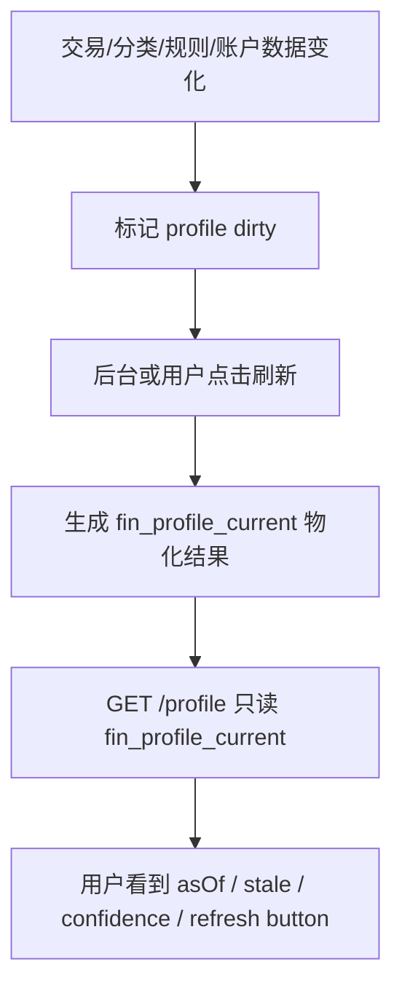
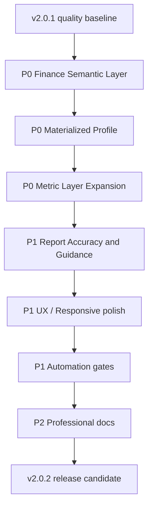

# FinSight v2.0.2 专业财务语义与体验质量计划

日期：2026-06-25
目标版本：v2.0.2
版本定位：Professional Finance Semantics, Materialized Analytics, Report Quality, UX Reliability
范围：个人账单专业性、分类与统计口径、Profile 物化计算、报表算法准确性、页面交互和布局、屏幕自适应、自动化门禁、文档。

## 1. 版本判断

v2.0.1 已经完成了不少质量收口：

- Profile GET 已经是 read-only cache，不再默认写 `fin_profile_snapshot`。
- Profile 已有 weighted score、`confidence`、`sampleMonths`。
- Forecast 已经从简单 rolling average 升级为 `hybrid_projection`。
- Forecast backtest 已经输出 MAPE、MAE、bias、coverage 和 insufficient sample 状态。
- Trend 的 `year(v.txn_date)` 热点过滤已经改为可索引 date range。
- CI 已有 backend performance、SQL gate、bundle、doc links。
- 前端 Profile、Dashboard、Reports、Transactions 都有一定 UI 优化。

但从专业个人财务系统角度看，当前仍有根本问题：

- 分类体系仍把“消费分类、资金流类型、资产负债变动、报销退款、投资行为”混在同一棵 `cls_category` 树里。
- `txn_types`、`report_role`、`txn_kind`、`direction`、`is_transfer`、`is_refund` 分散在不同层，缺少统一财务语义标准。
- 统计报表仍偏“交易汇总”，还没有形成清晰的现金流、损益、资产负债、预算、投资、债务、数据质量六类报表口径。
- Profile 虽然有缓存，但本质仍是“cache miss 后同步计算”；如果底层数据量大，第一次加载仍可能慢。
- 分类和规则治理已存在，但对用户来说仍像后台数据维护，不像专业账单系统的口径校准。
- 报表结论和 action 指导还不够强：知道发生了什么，但还不够能指导用户下一步怎么做。

v2.0.2 应定义为“专业财务语义版本”。目标不是新增功能，而是把现有功能的财务口径做专业、集中、可解释、可验收。

## 2. v2.0.2 版本边界

本版本做：

- 建立统一 Finance Semantic Layer，明确每笔交易的专业财务属性。
- 把分类从“页面分类树”升级为“交易分类 + 财务语义 + 报表角色”三层口径。
- Profile 改为物化结果优先：生成一次，第二次读取上次计算结果；用户可手动刷新重算。
- 统一报表统计口径，避免各报表自己解释收入、支出、转账、退款、投资和负债。
- 优化现有页面 UI、布局、响应式、交互，不新增大模块。
- 加强自动化：语义 SQL 审计、指标一致性测试、Profile materialization smoke、浏览器响应式 smoke。
- 补充专业财务文档：分类口径、指标口径、Profile 解释、刷新机制、数据质量影响。

本版本不做：

- 不引入复杂外部 AI。
- 不新增新的主导航模块。
- 不重写全部数据模型。
- 不破坏已有 `cls_category.code`。
- 不让用户直接暴露在复杂会计术语中；专业语义应服务报表，而不是增加使用负担。

## 3. 专业性质量评估

### 3.1 当前分类体系的问题

当前 L1 / L2 分类已经覆盖很多场景，例如收入、固定支出、日常生活、购物、交通、娱乐、报销、资产、负债、投资、理财、手续费等。这比普通记账软件更丰富，但专业性不足主要在于“分类维度混杂”。

示例问题：

- `收入` 里存在 `借款（他人借入）`，这不是收入，而是负债增加。
- `投资活动` 中的买入/卖出不是普通收入支出，应影响投资现金流和资产配置，不应直接污染消费趋势。
- `报销与返还` 同时可能是现金流入、退款、冲减费用、押金返还，不能简单归为收入。
- `固定支出` 与 `金融手续费`、`负债变动`、`理财与金融产品` 混合了消费、融资、资产配置和手续费。
- `其它消费` 仍是兜底，但在专业系统里应被视为数据质量风险，而不是正常分类。

专业账单系统应把一笔交易拆成多个语义维度：

| 维度 | 例子 | 用途 |
| --- | --- | --- |
| `cash_direction` | inflow / outflow / neutral | 现金流 |
| `economic_nature` | income / expense / transfer / refund / investment / liability / asset_adjustment | 财务本质 |
| `category_l1/l2` | 餐饮、交通、保险 | 消费和收入分析 |
| `report_role` | budget / cashflow / refund / transfer / asset / liability / investment | 报表归属 |
| `budget_behavior` | fixed / variable / discretionary / essential | 预算和控制 |
| `recurrence` | one_off / recurring / subscription / installment | 预测和账单 |
| `counterparty` | merchant / employer / bank / broker / family / government | 商户和来源 |
| `quality_state` | classified / inferred / unclassified / conflict | 数据可信度 |

### 3.2 当前统计口径的问题

当前报表体系能显示收入、支出、现金流、趋势、预算、forecast 和 profile，但专业口径还不够集中：

- 多个报表仍直接读 report SQL 或交易聚合，容易出现同一交易在不同报表中含义不一致。
- `fin_metric_monthly` 目前指标较少，主要是收入、支出、净现金流、储蓄率、未分类数量，无法支撑专业分析。
- 资产、负债、投资、退款、报销、转账、信用卡还款等复杂资金流没有统一月度指标层。
- Dashboard 的 `income/expense/net` 与 Profile、Forecast、Trend 的口径需要严格一致。
- Merchant、category、budget、cash risk 的统计口径还需要共享同一个语义过滤器。

### 3.3 Profile 性能与体验问题

当前 Profile 已经有 TTL cache，但还不是最稳的方式。用户提出“生成一次，第二次从之前计算里面拿，用户可以刷新重写数据”是正确方向。

建议 v2.0.2 把 Profile 改成：

这比普通 TTL cache 更适合专业财务系统，因为用户看到的是一个有时间戳、有版本、有数据质量说明的分析快照。

## 4. v2.0.2 总体路线

## 5. P0：统一财务语义层

目标：所有报表、Profile、Forecast、Dashboard、Transactions Detail 使用同一套财务语义口径。

### 5.1 新增 Finance Semantic Contract

执行任务：

- 新增 `docs/tech/finance/finance-semantic-contract.zh-cn.md`。
- 定义 `cash_direction`、`economic_nature`、`report_role`、`budget_behavior`、`recurrence`、`quality_state`。
- 明确每类交易如何影响报表：
  - 工资：income、cash inflow、计入收入趋势。
  - 报销到账：refund/reimbursement、cash inflow、不计入真实收入增长。
  - 消费退款：refund、冲减原消费，不计入收入。
  - 信用卡还款：liability transfer，不计入消费。
  - 基金申购：investment cash outflow，不计入消费预算。
  - 基金赎回：investment cash inflow，不计入收入趋势。
  - 账户间转账：neutral transfer，不计入收入/支出。
  - 手续费和利息：expense/cashflow，可计入现金流与费用分析。
- 将 `ClassificationL1TargetCatalog` 和 `ClassificationL2TargetCatalog` 与该 contract 对齐。
- 增加 semantic examples，覆盖至少 50 条典型账单文本。

验收标准：

- 每个 L1 和 L2 分类都有明确 `economic_nature` 和 `report_role`。
- 不存在“借款收到被计入收入趋势”“退款被计入收入”“投资买入被计入消费预算”的默认口径。
- 文档中每个核心报表都能追溯到该 semantic contract。

### 5.2 建立统一语义视图

执行任务：

- 新增或升级 `v_transaction_finance_semantics`，从 `v_transaction_analytics` 继续派生专业字段。
- 输出字段至少包括：
  - `cash_direction`
  - `economic_nature`
  - `report_role`
  - `budget_behavior`
  - `recurrence_hint`
  - `quality_state`
  - `include_in_income_trend`
  - `include_in_expense_trend`
  - `include_in_budget`
  - `include_in_cashflow`
  - `include_in_profile`
- 报表查询优先使用 semantic view，而不是每个 service 自己拼排除条件。
- 对语义视图建立 explain audit，确保不会引入不可控 CPU。

验收标准：

- Dashboard、Reports、Profile、Forecast、Trend 至少 P0 路径使用同一语义字段。
- `is_transfer`、`is_refund`、`report_role` 不再散落在多个 service 中重复判断。
- SQL gate 覆盖 semantic view 的热点查询。

### 5.3 分类专业化整理

执行任务：

- 将分类治理目标从“补 L2 分类”升级为“分类 + 财务本质 + 报表角色”。
- 审计当前 L1/L2 中不专业或歧义项：
  - `借款（他人借入）`
  - `借款（他人借出）`
  - `报销到账`
  - `消费退款`
  - `资产购买`
  - `信用卡还款`
  - `基金申购/赎回`
  - `其它消费`
- 给每个歧义项提供 merge / rename / alias / report role 修复方案。
- `其它消费` 不再作为正常消费分类展示，应在报表中显示为 data quality risk。
- 分类列表 UI 增加专业字段展示：报表角色、财务本质、是否计入预算、是否计入收入/支出趋势。

验收标准：

- 所有分类都有 `report_role`，且覆盖率 100%。
- 高风险分类歧义有迁移脚本、回滚说明和 dry-run 影响预览。
- `OTHER` 金额占比超过 5% 时，Dashboard / Reports / Profile 显示数据质量警告。

## 6. P0：Profile 物化结果优先

目标：Profile 不再依赖请求时同步全量计算。默认 GET 读取上次生成结果；用户可手动刷新重算。

### 6.1 新增 Profile Current Snapshot

执行任务：

- 新增 `fin_profile_current` 表，保存用户当前 Profile 物化结果。
- 建议字段：
  - `user_id`
  - `as_of_date`
  - `taxonomy_version`
  - `rule_set_version`
  - `metric_refresh_version`
  - `profile_version`
  - `overall_score`
  - `confidence`
  - `sample_months`
  - `payload_json`
  - `stale`
  - `computed_at`
  - `compute_duration_ms`
  - `error_message`
- GET `/api/v1/analytics/profile` 优先读取 `fin_profile_current`。
- 如果没有 current snapshot，返回 lightweight empty/degraded state，并提示用户刷新，而不是同步全量计算。
- 保留短 TTL cache，但只缓存 current snapshot，不缓存全量计算过程。

验收标准：

- Profile 第二次打开不触发 `computeProfile()`。
- Profile GET warm P95 小于 200ms，cold read P95 小于 500ms。
- 没有 current snapshot 时，页面可用且清楚提示“需要生成个人画像”。
- 当前结果展示 `computedAt`、`stale`、`confidence`、`dataVersion`。

### 6.2 用户手动刷新与后台刷新

执行任务：

- 新增 `POST /api/v1/analytics/profile/refresh`，显式重算并写入 `fin_profile_current`。
- 刷新完成后同步更新 `fin_profile_snapshot` 日历史。
- 前端 Profile 页面增加 Refresh 按钮，展示刷新中、刷新成功、刷新失败状态。
- 交易导入、分类变更、规则应用、账户余额变更后只标记 Profile stale，不立即重算。
- 保留夜间 scheduler，按 stale 用户批量刷新，限制每次用户数和执行时间。

验收标准：

- 用户点击 Refresh 后才触发完整 Profile 重算。
- 重复点击 Refresh 有防抖和并发保护，同一用户不能同时跑多个计算。
- 数据变更后 Profile 显示 stale 状态，不自动阻塞页面。
- 手动刷新失败时不会覆盖上一次成功结果。

### 6.3 Profile 性能与可观测性

执行任务：

- 记录 Profile 计算耗时、读取耗时、缓存命中、物化命中、stale 原因。
- `analytics-p95-smoke.sh` 区分 profile-read 和 profile-refresh 两类预算。
- 慢查询 audit 覆盖 Profile refresh 全链路。
- Profile refresh 内部按模块计时：metrics、wealth、cashflow、quality、concentration、scoring。

验收标准：

- profile-read P95 < 200ms。
- profile-refresh P95 < 3s，超过则日志分模块指出瓶颈。
- 连续打开 Profile 50 次，MySQL CPU 不持续超过 40%。
- 手动刷新 5 次，`fin_profile_current` 每用户只有一条 current 记录。

## 7. P0：扩展专业指标层

目标：让报表从“交易 SQL 聚合”转为“统一指标层 + 下钻交易明细”。

### 7.1 扩展 `fin_metric_monthly`

执行任务：

- 增加月度指标：
  - `REAL_INCOME`
  - `REFUND_INFLOW`
  - `REIMBURSEMENT_INFLOW`
  - `CONSUMPTION_EXPENSE`
  - `FIXED_EXPENSE`
  - `VARIABLE_EXPENSE`
  - `DISCRETIONARY_EXPENSE`
  - `ESSENTIAL_EXPENSE`
  - `INVESTMENT_INFLOW`
  - `INVESTMENT_OUTFLOW`
  - `LIABILITY_INFLOW`
  - `LIABILITY_REPAYMENT`
  - `TRANSFER_IN`
  - `TRANSFER_OUT`
  - `FEE_EXPENSE`
  - `UNCLASSIFIED_AMOUNT`
  - `OTHER_AMOUNT`
  - `DATA_QUALITY_SCORE`
- 指标全部基于 semantic view 生成。
- 历史指标 refresh 支持 dry-run、diff、apply、rollback。

验收标准：

- Dashboard、Forecast、Profile 的收入/支出口径来自同一指标层。
- 任一指标可以下钻到交易样本并解释 inclusion/exclusion。
- 指标 reconciliation 与 report SQL 差异小于 0.1%，否则进入 degraded 状态。

### 7.2 指标一致性测试

执行任务：

- 增加 golden dataset，覆盖工资、报销、退款、信用卡还款、转账、投资买卖、手续费、消费。
- 为每类交易定义预期指标影响。
- 新增 `FinanceSemanticMetricsTest`。
- 将指标一致性测试纳入 backend-performance 或独立 CI job。

验收标准：

- golden dataset 下所有指标值固定可复现。
- 新分类或规则变更导致指标变化时，测试能暴露影响。
- 任何人改报表口径必须同步更新 semantic contract 和测试。

## 8. P1：报表专业化与用户指导

目标：报表不仅展示数据，还要能指导用户做财务决策。

### 8.1 报表体系重新归类

执行任务：

- 将现有报表分成 6 类：
  - Cashflow：现金流、现金风险、账单日历。
  - Spending：消费结构、预算执行、固定/可变、支出漂移。
  - Income：真实收入、收入稳定性、收入来源。
  - Balance Sheet：资产、负债、净资产、流动性。
  - Investment / Debt：投资现金流、债务偿还、手续费和利息。
  - Data Quality：未分类、其它消费、退款/转账识别、规则覆盖。
- UI 上不一定新增菜单，但报表页和文档要采用该分组。
- 报表标题和说明避免混用“收入/现金流入”“支出/现金流出”“消费/投资/负债”。

验收标准：

- 用户能知道每张报表回答什么问题。
- 每张报表有“口径说明”和“下一步建议”。
- 报表之间收入、支出、净现金流数字一致。

### 8.2 Insight 指导增强

执行任务：

- 每个 Insight 采用统一结构：Finding、Why it matters、Evidence、Action、Expected impact。
- Advisor 卡片排序继续使用 impact、urgency、confidence、actionability，但 confidence 必须结合 data quality。
- Profile action links 指向更准确的报表和筛选条件。
- 对用户给出建议时区分：
  - 需要补数据。
  - 需要改分类。
  - 需要降低支出。
  - 需要调整预算。
  - 需要准备现金储备。
  - 需要检查债务或投资现金流。

验收标准：

- 每张 Advisor card 至少有 1 条可验证 evidence 和 1 个明确 action。
- 数据质量不足时，优先建议修数据，不给过度确定的财务建议。
- 用户点击 action 后能进入带筛选上下文的页面。

### 8.3 算法准确性继续收口

执行任务：

- Forecast 使用 expanded metric layer，区分真实收入、退款、投资流入、借款流入。
- Profile scoring 引入 semantic metrics，不再依赖混合口径的 expense / income。
- Cash Risk 引入未来账单、固定还款、信用卡还款和低置信度标记。
- Spending concentration 同时计算 category、merchant、essential/discretionary 三种集中度。

验收标准：

- Forecast 不把投资赎回、借款收到、退款当成工资收入。
- Profile 不把基金申购当成生活消费压力。
- Cash Risk 明确区分“真实现金风险”和“投资/转账导致的现金流波动”。

## 9. P1：页面交互、布局和响应式

目标：保持现有功能，但让专业信息更集中、更清晰、更适合日常使用。

### 9.1 Profile 页面

执行任务：

- 增加 Profile header：score、confidence、computedAt、stale、refresh button、data quality warning。
- 首次无物化结果时显示 Generate Profile CTA。
- 刷新时展示分阶段状态：Collect metrics、Compute scores、Persist snapshot、Done。
- Dimension Drawer 增加“口径说明”和“引用指标”。
- 移动端把维度列表设为主视图，Radar 仅桌面展示。

验收标准：

- 360px 下 Profile 首屏能看到 score / stale / refresh。
- 用户知道结果是否过期，以及如何重算。
- Refresh 不导致页面卡死或重复请求。

### 9.2 Transactions / Detail

执行任务：

- 在交易明细中展示专业语义标签：真实消费、退款、报销、转账、投资、负债、手续费、其它/待确认。
- Detail 展开区展示该交易如何影响报表：计入哪些指标、不计入哪些指标、原因。
- 筛选支持 semantic filters：只看真实消费、只看退款、只看投资流、只看债务流、只看数据质量问题。
- 批量分类预览增加 semantic impact：分类前后会影响哪些报表和指标。

验收标准：

- 用户能从交易明细理解为什么某笔钱没有进入收入/支出报表。
- 语义筛选不改变原交易，只改变查看范围。
- 批量改分类前能看到报表影响。

### 9.3 Reports / Dashboard

执行任务：

- Dashboard KPI 改用 semantic metric layer，明确 Real income、Consumption expense、Net cashflow、Liquidity runway。
- Reports 页面增加统一的 metric explanation popover。
- Drilldown drawer 显示 semantic inclusion/exclusion。
- Data Quality Strip 更突出：unclassified、other、refund detected、transfer detected、metric degraded。

验收标准：

- Dashboard KPI 与 Profile / Forecast 口径一致。
- 每个报表数字都可以解释来自哪些 semantic metrics。
- 移动端报表无横向溢出、无图表空白、无按钮遮挡。

## 10. P1：代码质量与架构治理

目标：让语义、指标、报表、Profile 不再分散。

执行任务：

- 新增 `finance-semantic` 包或 support 层，集中管理交易语义。
- 用 typed DTO / record 替代 analytics 关键路径中的 `Map<String, Object>`。
- 将 Profile compute 拆分为：
  - `ProfileInputLoader`
  - `ProfileScoreCalculator`
  - `ProfileMaterializationService`
  - `ProfileRefreshService`
  - `ProfileCurrentRepository`
- 将 metric refresh 拆成 semantic query、aggregation、persistence、reconciliation。
- 前端将 Profile Refresh、Transactions semantic tags、Report explanation 抽为复用组件。
- 保持 API 兼容，新增字段只 additive。

验收标准：

- Profile service 不再承担加载、计算、持久化、缓存全部职责。
- 语义判断不散落在多个 service 的 SQL 字符串中。
- 新增核心逻辑有单元测试。
- 不引入破坏性 API 变更。

## 11. P1：自动化程序与质量门禁

目标：用自动化保证专业口径和性能不会回退。

执行任务：

- 新增 `finance-semantic-contract` 测试，固定交易样本验证语义输出。
- 新增 `metric-monthly-golden` 测试，验证 expanded metrics。
- 新增 Profile materialization smoke：
  - GET 不计算。
  - POST refresh 计算并写 current。
  - 第二次 GET 读 current。
  - stale 标记正确。
- 扩展 `analytics-p95-smoke.sh`：
  - profile-read < 200ms。
  - profile-refresh < 3s。
  - dashboard metrics < 800ms。
  - transactions stats < 800ms。
- 增加 Playwright 响应式 smoke，覆盖 Profile refresh、Transactions semantic filter、Dashboard、Reports drilldown。
- SQL gate 扩展：禁止在热点 service 中直接判断 `is_refund/is_transfer/report_role`，应调用 semantic view/helper。
- 文档 gate：semantic contract、metric guide、release checklist 必须存在。

验收标准：

- CI 能阻止“退款被计入收入”“投资买入被计入消费”“信用卡还款被计入支出趋势”这类专业错误。
- CI 能阻止 Profile GET 重新变成同步计算。
- 浏览器 smoke 有截图证据。
- 文档链接检查通过。

## 12. P2：专业财务文档

目标：用户理解系统，开发者遵循口径，发布者可验收。

执行任务：

- 新增 `docs/tech/finance/finance-semantic-contract.zh-cn.md`。
- 新增 `docs/tech/finance/personal-finance-reporting-guide.zh-cn.md`。
- 新增 `docs/tech/finance/profile-materialization-runbook.zh-cn.md`。
- 新增 `docs/tech/ops/v2.0.2-release-checklist.zh-cn.md`。
- 更新 `REPORT_UI.md`，加入 semantic tags、Profile refresh、metric explanation、responsive requirements。
- 更新用户文档：如何解读收入、现金流、消费、退款、投资、负债、Profile 分数。

验收标准：

- 用户能从文档知道为什么退款不是收入、投资不是消费、信用卡还款不是生活支出。
- 开发者新增报表时必须引用 semantic contract。
- 发布 checklist 每项都有命令或截图证据。

## 13. GitHub Issue 拆分建议

| 优先级 | Issue | 验收重点 |
| --- | --- | --- |
| P0 | Define Finance Semantic Contract | 每类交易的财务本质和报表归属清楚 |
| P0 | Add semantic transaction view/helper | 报表共享统一 inclusion/exclusion |
| P0 | Materialize Profile current result | GET 读 current，POST refresh 重算 |
| P0 | Expand monthly metric layer | 真实收入、消费、退款、投资、负债等指标可用 |
| P0 | Add semantic golden tests | 阻止专业口径回归 |
| P1 | Professionalize category/report role mapping | 歧义分类有修复方案和 dry-run |
| P1 | Profile refresh UX | stale、computedAt、refresh 状态清楚 |
| P1 | Transactions semantic tags and filters | 用户能理解交易如何影响报表 |
| P1 | Report metric explanations | 每个数字能解释口径和来源 |
| P1 | Browser responsive smoke | Profile、Transactions、Reports、Dashboard 覆盖 |
| P2 | Finance reporting docs and v2.0.2 checklist | 用户和维护者都有专业文档 |

## 14. v2.0.2 发布验收标准

v2.0.2 只有在以下条件全部满足后才能发布：

- 所有 L1 / L2 分类有明确 `economic_nature` 和 `report_role`。
- semantic contract 覆盖工资、报销、退款、信用卡还款、转账、投资买卖、手续费、借款、押金等典型场景。
- Dashboard、Reports、Profile、Forecast 至少 P0 指标使用统一 semantic layer。
- Profile GET 默认读取 `fin_profile_current`，不触发完整计算。
- 用户可手动刷新 Profile，刷新失败不覆盖旧结果。
- profile-read P95 < 200ms，profile-refresh P95 < 3s。
- 连续打开 Profile 50 次 MySQL CPU 不持续超过 40%。
- Expanded monthly metrics 通过 golden dataset 测试。
- Forecast 不把退款、投资赎回、借款收到计入真实收入趋势。
- Profile 不把投资买入、信用卡还款、账户转账计入生活消费压力。
- Transactions Detail 可以展示交易语义和报表影响。
- 360、390、768、1024、1440、1920 视口下核心页面无明显布局错误。
- CI 包含 semantic tests、metric golden tests、Profile materialization smoke、SQL gate、browser smoke、doc links。
- v2.0.2 release checklist、semantic contract、reporting guide、Profile materialization runbook 完成。

## 15. 建议实施节奏

### v2.0.2-alpha.1：语义合同和现状审计

- 输出 finance semantic contract。
- 审计现有分类和 report role。
- 建立 semantic golden dataset。
- 确定 Profile materialization 表结构。

通过条件：

- 能明确指出每类交易如何影响每张报表。
- 所有高风险分类有修复方案。

### v2.0.2-beta.1：语义层和指标层落地

- 实现 semantic view/helper。
- 扩展 `fin_metric_monthly`。
- 完成 metric golden tests。
- 报表 P0 路径切换到 semantic metrics。

通过条件：

- Dashboard / Profile / Forecast 核心数字一致。
- 专业口径错误能被测试拦住。

### v2.0.2-beta.2：Profile 物化和 UX

- `fin_profile_current` 落地。
- GET 读 current，POST refresh 重算。
- 前端 Profile refresh UX 完成。
- profile-read / refresh smoke 加入自动化。

通过条件：

- 第二次打开 Profile 不重新计算。
- 用户能手动刷新并看到 stale / computedAt。

### v2.0.2-rc.1：报表、交易明细和文档收口

- Transactions semantic tags/filter 完成。
- Report explanations 完成。
- 响应式浏览器 smoke 完成。
- 文档和 release checklist 完成。

通过条件：

- 全量 CI 连续 3 次通过。
- 发布清单每项都有证据。

## 16. 结论

v2.0.2 的核心不是再做更多页面，而是把 FinSight 从“功能丰富的记账系统”推进到“专业可信的个人财务分析系统”。

专业性的关键是口径统一：退款不是收入，投资不是消费，信用卡还款不是生活支出，转账不是收入也不是支出。只有这些底层语义稳定，Profile、Forecast、Dashboard、Reports 才能真正指导用户。

Profile 性能的关键是物化：生成一次、读取多次、用户主动刷新、后台按需刷新。这样既能保护 MySQL，也能让用户知道分析结果的时间、版本和可信度。
